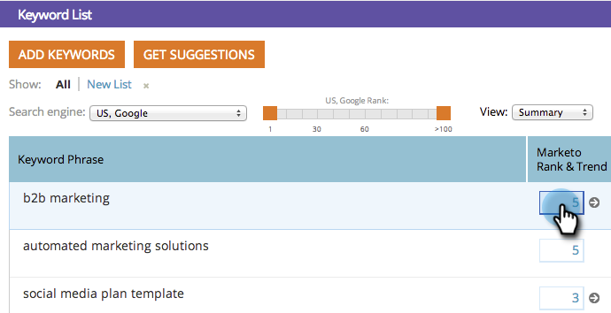

# SEO - Graphique des tendances des mots-clés {#seo-keyword-trends-chart}

Il est important de surveiller la tendance de votre mot-clé [Rangs SERP](/help/marketo/product-docs/additional-apps/seo/understanding-seo/understanding-search-engine-optimization.md) au fil du temps. Consultez ce graphique pratique pour suivre la progression.

>[!IMPORTANT]
>
>Le 31 mars 2026, Marketo Engage abandonnera la fonctionnalité Optimisation du moteur de recherche. Veuillez exporter toutes les données pertinentes au plus tard le 30 mars. [En savoir plus](https://nation.marketo.com/t5/product-blogs/marketo-engage-seo-feature-deprecation/ba-p/359060){target="_blank"}.
>
>* [Problèmes d’exportation](https://experienceleague.adobe.com/en/docs/marketo/using/product-docs/additional-apps/seo/pages/seo-export-issues-to-csv){target="_blank"}
>* [Résultats de l’exportation des mots-clés](https://experienceleague.adobe.com/en/docs/marketo/using/product-docs/additional-apps/seo/keywords/seo-exporting-keyword-results){target="_blank"}
>* [Tendances de l’exportation des mots-clés](https://experienceleague.adobe.com/en/docs/marketo/using/product-docs/additional-apps/seo/reports/seo-use-the-keyword-trends-report#exporting-data){target="_blank"}
>* [Exporter les tendances des mots-clés des concurrents](https://experienceleague.adobe.com/en/docs/marketo/using/product-docs/additional-apps/seo/reports/seo-use-the-competitor-kw-trends-report#exporting-data){target="_blank"}

1. Accédez à la section **[!UICONTROL Mots-clés]**.

   

1. Cliquez sur la zone de classement pour le mot-clé dont vous souhaitez suivre la tendance.

   

   Il affiche votre [Rang SERP](/help/marketo/product-docs/additional-apps/seo/understanding-seo/understanding-search-engine-optimization.md) pour les 30 derniers jours :

   

   >[!TIP]
   >
   >Pour en savoir plus sur le classement des mots-clés, consultez le Rapport sur les tendances des mots-clés .

   >[!MORELIKETHIS]
   >
   >[Utilisation du rapport Tendances des mots-clés](/help/marketo/product-docs/additional-apps/seo/reports/seo-use-the-keyword-trends-report.md)
