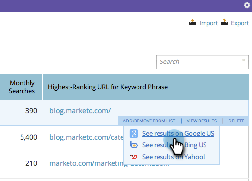

# SEO - Afficher les résultats des mots-clés dans un moteur de recherche {#seo-view-keyword-results-in-search-engine}

Si vous souhaitez voir à quoi ressemble votre contenu dans un moteur de recherche, nous avons ajouté un raccourci pratique.

1. Accédez à la section **[!UICONTROL Mots-clés]** .

   

1. Pointez sur un mot-clé. Cliquez sur **[!UICONTROL Afficher les résultats]**.

   

1. Sélectionnez le moteur de recherche dans lequel vous souhaitez afficher vos résultats.

   

Les résultats de la recherche de votre mot-clé doivent maintenant s’afficher dans une nouvelle fenêtre.

