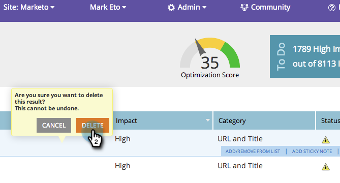

# SEO - Supprimer/Supprimer un problème de page {#seo-remove-delete-a-page-issue}

Tous les problèmes de page ne sont pas utiles pour vous. Voici comment en supprimer un :

1. Accédez à la section **Pages** .

   

1. Dans la section des pages, cliquez sur **Problèmes**.

   

1. Passez la souris sur le problème de page à supprimer. Cliquez sur **SUPPRIMER**.

   

1. Cliquez sur **DELETE** pour supprimer définitivement ce problème de page.

   >[!CAUTION]
   >
   >Vous ne pouvez pas annuler cette action. Une fois qu’un problème est supprimé, vous pouvez recréer les problèmes en supprimant la page et en l’ajoutant à nouveau.

   

   Doux ! Votre problème de page est maintenant supprimé.

