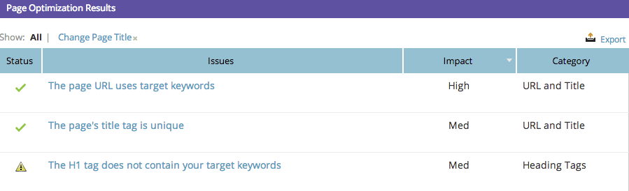

# SEO - Utilisation de l’analyse en profondeur des détails de la page {#seo-using-the-page-detail-drill-down}

Vous pouvez voir de nombreuses informations sur vos pages à l’aide de l’analyse détaillée de la page.

>[!IMPORTANT]
>
>Le 31 mars 2026, Marketo Engage abandonnera la fonctionnalité Optimisation du moteur de recherche. Veuillez exporter toutes les données pertinentes au plus tard le 30 mars. [En savoir plus](https://nation.marketo.com/t5/product-blogs/marketo-engage-seo-feature-deprecation/ba-p/359060){target="_blank"}.
>
>* [Problèmes d’exportation](https://experienceleague.adobe.com/fr/docs/marketo/using/product-docs/additional-apps/seo/pages/seo-export-issues-to-csv){target="_blank"}
>* [Résultats de l’exportation des mots-clés](https://experienceleague.adobe.com/fr/docs/marketo/using/product-docs/additional-apps/seo/keywords/seo-exporting-keyword-results){target="_blank"}
>* [Tendances de l’exportation des mots-clés](https://experienceleague.adobe.com/fr/docs/marketo/using/product-docs/additional-apps/seo/reports/seo-use-the-keyword-trends-report#exporting-data){target="_blank"}
>* [Exporter les tendances des mots-clés des concurrents](https://experienceleague.adobe.com/fr/docs/marketo/using/product-docs/additional-apps/seo/reports/seo-use-the-competitor-kw-trends-report#exporting-data){target="_blank"}

## Rechercher l&#39;analyse de page {#find-page-drill-down}

1. Accédez à la section **[!UICONTROL Pages]**.

   

1. Cliquez sur la page dont vous souhaitez afficher les détails.

   

   Voici, l’analyse des détails de la page.

   

## Section [!UICONTROL Détails de la page] {#page-detail-section}

| Élément | Description |
|---|---|
| [!UICONTROL &#x200B; Score d’optimisation &#x200B;] | La sauce secrète utilisée pour vous montrer comment votre page est optimisée pour la recherche sur une échelle de 1 à 100. |
| Zone [!UICONTROL &#x200B; À faire &#x200B;] | Affiche le nombre de problèmes ouverts concernant la page sur laquelle vous vous trouvez. |
| [!UICONTROL Nombre total de liens entrants] | Nombre total de liens entrants vers votre site web. |
| [!UICONTROL Liens entrants (domaines uniques)] | Nombre d’autres sites web comportant au moins un lien entrant vers votre site. |
| [!UICONTROL &#x200B; Liens sortants &#x200B;] | Nombre de liens renvoyant à d’autres sites web à partir de cette page spécifique. |
| [!UICONTROL Partages Facebook] | Nombre de fois où cette page a été partagée sur [!DNL Facebook]. |
| [!UICONTROL J’aime Facebook] | Nombre de fois où ce partage de page a été apprécié sur [!DNL Facebook]. |
| [!UICONTROL Clics Facebook] | Nombre de clics effectués à partir du [!DNL Facebook share]. |

## [!UICONTROL Mot(s)-clé(s) pour lequel la page est optimisée]  {#keyword-s-that-page-is-optimized-for}

C’est là que vous [sélectionnez le mot-clé pour lequel vous essayez d’optimiser votre page](/help/marketo/product-docs/additional-apps/seo/keywords/seo-optimize-specific-pages-with-targeted-keywords.md).

>[!NOTE]
>
>Il s’agit d’une étape importante pour tirer le meilleur parti de cette fonctionnalité. Nous vous recommandons d’utiliser moins de trois mots-clés par page. Idéalement, juste un.

## [!UICONTROL Résultats de l’optimisation de la page] {#page-optimization-results}

Les [!UICONTROL &#x200B; Résultats de l’optimisation de la page &#x200B;] vous indiqueront les étapes exactes à suivre pour augmenter votre score d’optimisation ou obtenir de meilleures performances lors de la recherche de cette page.

>[!MORELIKETHIS]
>
>[Optimiser des pages spécifiques avec des mots-clés ciblés](/help/marketo/product-docs/additional-apps/seo/keywords/seo-optimize-specific-pages-with-targeted-keywords.md)
