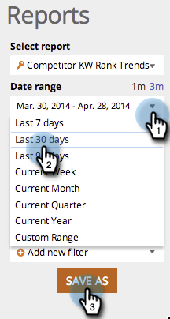

# Optimisation du moteur de recherche : utilisez le rapport Tendances des mots de passe concurrents {#seo-use-the-competitor-kw-trends-report}

Dans ce rapport, vous pouvez voir comment vous et vos concurrents êtes classés sur la base des mots-clés au fil du temps.

## Rechercher rapports {#find-reports}

1. Accédez à **[!UICONTROL Rapports]**.

   

1. Cliquez sur **[!UICONTROL Tendances de classement KW concurrentes]**.

   

## Graphique des tendances du classement KW {#kw-rank-trends-graph}

Ce graphique peut vous montrer quel pourcentage de vos mots-clés est classé dans une plage spécifiée et comment vos concurrents se comparent.

| Élément | Description |
|---|---|
| [!UICONTROL Mots-clés] | Nombre de mots-clés dont vous effectuez le suivi. |
| [!UICONTROL URL de classement] | Le nombre d’URL de votre site se classant dans la plage que vous avez définie. |
| [!UICONTROL &#x200B; % en rang] | Pourcentage du classement des mots-clés dans la plage que vous avez définie. |
| [!UICONTROL Moy. recherches] | Nombre moyen de recherches sur ces mots-clés qui se sont produites au cours de la plage que vous avez définie (au cours des 30 derniers jours, sur la recherche Google US) |

## Filtrer les données {#filtering-data}

1. Cliquez sur le menu déroulant et sélectionnez la période souhaitée.

   

1. Cliquez sur le menu déroulant **[!UICONTROL Classement]** pour choisir la plage de classement pour laquelle vous souhaitez afficher les mots-clés.

   

## Exportation des données {#exporting-data}

1. Cliquez sur **[!UICONTROL Exporter au format CSV]** ou **[!UICONTROL Export PDF]**.

   
