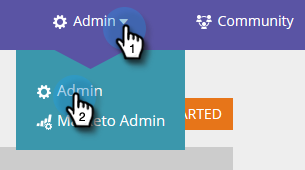

# SEO - Ajouter un site/Supprimer un site {#seo-add-a-site-delete-a-site}

Pour que Marketing puisse extraire des données (liens entrants et recommandations) pertinentes pour les pages de votre site, vous devez définir l’URL du site ici.

>[!NOTE]
>
>**Disponibilité**
>
>Tous les clients n’ont pas acheté cette fonctionnalité. Contactez votre représentant commercial pour plus de détails.

## Ajouter un site {#add-a-site}

1. Cliquez sur la liste déroulante Admin et sélectionnez **Admin**.

   >[!NOTE]
   >
   >**Autorisations d’administrateur requises**

   

1. Cliquez sur **Ajouter le site**.

   

1. Saisissez le **nom, l’URL du site Web** et cliquez sur **Enregistrer**.

   >[!TIP]
   >
   >Vous pouvez également ajouter une ** ****URL du blog** si vous en avez une.

   

   Super ! Vous venez d&#39;ajouter un autre site.

   

## Supprimer un site {#delete-a-site}

Si vous effectuez le suivi de plusieurs sites, vous pouvez également supprimer un site que vous ne souhaitez plus optimiser.

1. Cliquez sur la liste déroulante Admin et sélectionnez **Admin**.

   

1. Cliquez sur le site à supprimer.

   

1. Cliquez sur **Supprimer**.

   
Confirmez que vous souhaitez supprimer.
   

   >[!NOTE]
   >
   >Vous ne pouvez supprimer un site que si vous en avez plusieurs. Si vous n&#39;en avez qu&#39;un, vous pouvez effectuer une réinitialisation en sélectionnant le site et en cliquant sur **Réinitialiser**. La réinitialisation d&#39;un site *supprime toutes les données du site* et recrée le site.

