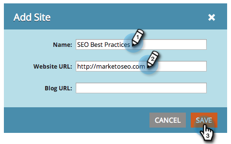

# SEO - Ajout/suppression d’un site {#seo-add-a-site-delete-a-site}

Pour que Marketo puisse extraire des données (liens entrants et recommandations) pertinentes pour les pages de votre site, vous devez définir ici l’URL du site.

>[!AVAILABILITY]
>
>Tous les utilisateurs de Marketo Engage n’ont pas acheté cette fonctionnalité. Pour plus d’informations, contactez l’équipe du compte d’Adobe (votre gestionnaire de compte).

## [!UICONTROL Ajout d’un site] {#add-a-site}

1. Cliquez sur la liste déroulante Admin et sélectionnez **[!UICONTROL Administration]**.

   >[!NOTE]
   >
   >**Autorisations d’administrateur requises**

   

1. Cliquez sur **[!UICONTROL Ajouter un site]**.

   

1. Saisissez le **[!UICONTROL Nom], [!UICONTROL URL du site Web]** et cliquez sur **[!UICONTROL Enregistrer]**.

   >[!TIP]
   >
   >Vous pouvez également ajouter une **[!UICONTROL URL du blog]** si vous en avez un.

   

   Fantastique ! Vous venez d&#39;ajouter un autre site.

   

## Suppression d’un site {#delete-a-site}

Si vous effectuez le suivi de plusieurs sites, vous pouvez également supprimer un site qui n’est plus intéressé par l’optimisation.

1. Cliquez sur la liste déroulante Admin et sélectionnez **[!UICONTROL Administration]**.

   

1. Cliquez sur le site à supprimer.

   

1. Cliquez sur **[!UICONTROL Supprimer]**.

   

1. Confirmez que vous souhaitez **[!UICONTROL Supprimer]**.

   

   >[!NOTE]
   >
   >Vous ne pouvez supprimer un site que si vous en avez plusieurs. Si vous n’en avez qu’un seul, vous pouvez réinitialiser en sélectionnant le site et en cliquant sur **[!UICONTROL Réinitialiser]**. La réinitialisation d’un site _supprimer toutes les données du site ;_ et recréez le site.
