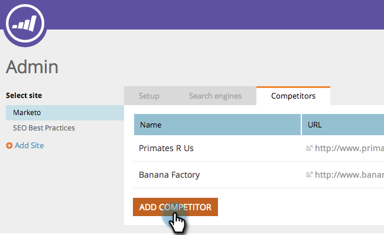

# SEO - Concurrents d&#39;Ajoute {#seo-add-competitors}

Les concurrents d&#39;Ajoute vous permettent de suivre leurs performances pour les mêmes mots-clés et liens entrants que ceux que vous avez choisis de surveiller.

>[!NOTE]
>
>**Autorisations d’administrateur requises**

1. Accédez à la section **Admin**.

   

1. Cliquez sur l&#39;onglet **Concurrents**.

   

1. Cliquez sur **Ajouter le Concurrent**.

   

1. Tapez **Nom** et **URL** de votre concurrent.

   

   Cinq ! Vous devriez maintenant voir votre concurrent dans la liste.

   

   Félicitations ! Vous êtes un pas de plus vers l&#39;écrasement total.

   >[!MORELIKETHIS]
   >
   >* [Mots-clés de Ajoute](/help/marketo//product-docs/additional-apps/seo/keywords/seo-add-keywords.md)
   >* [Présentation des mots-clés (Vue de Concurrent)](/help/marketo/product-docs/additional-apps/seo/keywords/seo-understanding-keywords.md)

