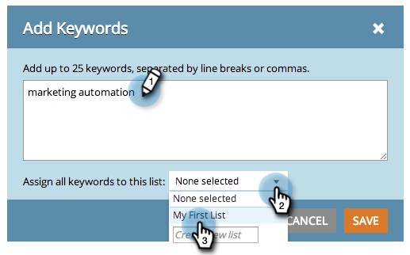

# SEO - Gestion de listes {#seo-managing-lists}

Vous pouvez ajouter des éléments aux listes lorsque vous ajoutez des mots-clés, des pages, des problèmes de page ou des liens entrants. Les listes vous aident à rester organisé et vous permettent de filtrer les rapports pour n’afficher que les données de cette liste. Voici comment les fabriquer.

>[!IMPORTANT]
>
>Le 31 mars 2026, Marketo Engage abandonnera la fonctionnalité Optimisation du moteur de recherche. Veuillez exporter toutes les données pertinentes au plus tard le 30 mars. [En savoir plus](https://nation.marketo.com/t5/product-blogs/marketo-engage-seo-feature-deprecation/ba-p/359060){target="_blank"}.
>
>* [Problèmes d’exportation](https://experienceleague.adobe.com/en/docs/marketo/using/product-docs/additional-apps/seo/pages/seo-export-issues-to-csv){target="_blank"}
>* [Résultats de l’exportation des mots-clés](https://experienceleague.adobe.com/en/docs/marketo/using/product-docs/additional-apps/seo/keywords/seo-exporting-keyword-results){target="_blank"}
>* [Tendances de l’exportation des mots-clés](https://experienceleague.adobe.com/en/docs/marketo/using/product-docs/additional-apps/seo/reports/seo-use-the-keyword-trends-report#exporting-data){target="_blank"}
>* [Exporter les tendances des mots-clés des concurrents](https://experienceleague.adobe.com/en/docs/marketo/using/product-docs/additional-apps/seo/reports/seo-use-the-competitor-kw-trends-report#exporting-data){target="_blank"}

1. Cliquez sur **[!UICONTROL Ajouter des mots-clés]**.

   >[!NOTE]
   >
   >Cela fonctionne de la même manière lors de l’ajout de pages, de problèmes de pages et de liens entrants.

   

1. Saisissez le mot-clé . Sélectionnez une liste à laquelle l’ajouter dans la liste déroulante.

   

   >[!TIP]
   >
   >Vous pouvez créer une liste dans la liste déroulante. Saisissez un titre, puis appuyez sur la touche Retour.

1. Cliquez sur **[!UICONTROL Enregistrer]**

   
