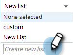

# SEO - Gestion des Listes {#seo-managing-lists}

Vous pouvez ajouter des éléments aux listes lorsque vous ajoutez des mots-clés, des pages, des problèmes de page ou des liens entrants. Les listes vous aident à rester organisées et vous permettent de filtrer les rapports pour n’afficher que les données de cette liste. Voici comment les fabriquer :

1. Cliquez sur **AJOUTER MOTS-CLÉS**.

   >[!NOTE]
   >
   >Cela fonctionne de la même manière lors de l’ajout de pages, de problèmes de pages et de liens entrants.

   

1. Entrez le mot-clé. Sélectionnez une liste à laquelle vous souhaitez l’ajouter dans la liste déroulante.

   

   >[!TIP]
   >
   >Vous pouvez créer une liste dans la liste déroulante. Entrez un titre, appuyez sur la touche Retour.     >

1. Cliquez sur **SAVE**.

   

   Heureuse organisation !

