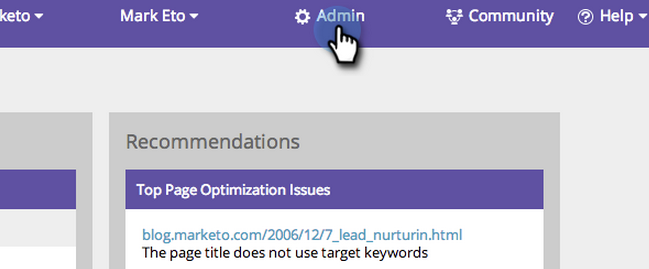

# SEO - Sélectionner la région/le pays pour votre moteur de recherche {#seo-pick-region-country-for-your-search-engine}

Les administrateurs d’optimisation du référencement peuvent sélectionner la région du moteur de recherche que vous souhaitez utiliser pour obtenir les informations de classement de mots-clés.

>[!NOTE]
>
>**Autorisations d’administrateur requises**

1. Accédez à la section Admin.

1. Cliquez sur l&#39;onglet Moteurs de recherche.

   

1. Sélectionnez le pays/la ville pour lequel vous souhaitez optimiser et cliquez sur ENREGISTRER.

>[!NOTE]
>
>Par défaut, vous pouvez utiliser un pays pour un seul moteur de recherche. Si vous avez besoin de plus, contactez votre représentant commercial.

Excellent travail. Vous verrez maintenant les classements de mots-clés pour le pays ou la ville de votre choix.

>[!MORELIKETHIS]
>
>* [Comprendre le Tableau de bord : Instantané SEO](understanding-the-seo-dashboard-seo-snapshot.md)
>* [Comprendre le Tableau de bord : SEO Recommendations](understanding-the-seo-dashboard-seo-recommendations.md)

>

