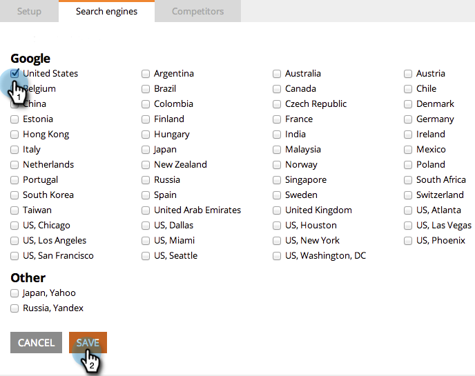

# SEO - Sélectionnez la région/le pays pour votre moteur de recherche {#seo-pick-region-country-for-your-search-engine}

Les administrateurs d’optimisation pour les moteurs de recherche pourront sélectionner la région pour laquelle vous souhaitez obtenir des informations sur le classement des mots-clés.

>[!NOTE]
>
>**Autorisations d’administrateur requises**

1. Accédez à la section **[!UICONTROL Admin]** .

1. Cliquez sur l’onglet **[!UICONTROL Moteurs de recherche]** .

   

1. Sélectionnez le pays/la ville pour lequel vous souhaitez optimiser et cliquez sur **[!UICONTROL Enregistrer]**.

>[!NOTE]
>
>Par défaut, vous pouvez utiliser un pays pour un moteur de recherche. Si vous avez besoin de plus, contactez votre représentant commercial.

Excellent travail. Vous verrez désormais les classements des mots-clés pour le pays ou la ville de votre choix.

>[!MORELIKETHIS]
>
>* [Présentation du tableau de bord : instantané d’optimisation pour les moteurs de recherche](/help/marketo/product-docs/additional-apps/seo/understanding-seo/understanding-the-seo-dashboard-seo-snapshot.md){target="_blank"}
>* [Compréhension du tableau de bord : Recommendations SEO](/help/marketo/product-docs/additional-apps/seo/understanding-seo/understanding-the-seo-dashboard-seo-recommendations.md){target="_blank"}
