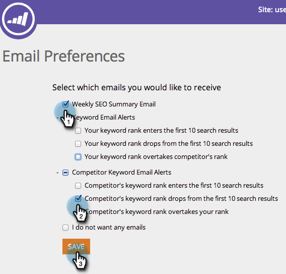

# SEO - Définissez vos préférences d&#39;alerte par courriel {#seo-set-your-email-alert-preferences}

Vous pouvez personnaliser vos préférences de courriel pour déterminer quand vous serez mis à jour sur vos efforts d’optimisation du référencement.

1. Dans la barre de navigation supérieure, cliquez sur votre nom d’utilisateur. Cliquez sur **Préférences de courriel**.

   

1. Indiquez ce dont vous souhaitez être averti par courriel.

   

   Groovy. Vos préférences seront enregistrées automatiquement.

