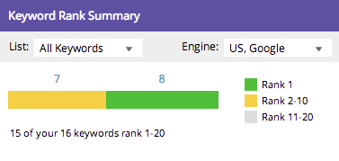

# Présentation du tableau de bord de SEO : instantané de SEO {#understanding-the-seo-dashboard-seo-snapshot}

Utilisez le tableau de bord pour obtenir une vue d’ensemble de la tendance du classement des mots-clés et de la manière dont votre site est optimisé pour l’optimisation du moteur de recherche (SEO).

Pour savoir sur quoi vous concentrer pour améliorer vos efforts d’optimisation du moteur de recherche (SEO), utilisez la section [[!UICONTROL Recommandations]](/help/marketo/product-docs/additional-apps/seo/understanding-seo/understanding-the-seo-dashboard-seo-recommendations.md) de ce tableau de bord.

## [!UICONTROL Résumé du classement des mots-clés] {#keyword-rank-summary}

Cette section vous explique comment votre site est classé pour les [ mots-clés que vous ciblez ](/help/marketo/product-docs/additional-apps/seo/keywords/seo-add-keywords.md).

| Couleur | Classement |
|---|---|
| Vert | 1er résultat de la recherche |
| Jaune | 2e - 10e résultat dans la recherche |
| Gris | 11ème - 20ème résultat dans la recherche |

>[!TIP]
>
>Vous pouvez également afficher les performances d’une liste [spécifique](/help/marketo/product-docs/additional-apps/seo/keywords/seo-add-remove-keywords-from-a-list.md) de mots-clés. Cliquez sur la liste déroulante et sélectionnez celle qui vous intéresse.

>[!NOTE]
>
>Les données ne s’affichent que pour les mots-clés classés entre 1 et 100.

## [!UICONTROL Score moyen d’optimisation de page] {#average-page-optimization-score}

Le [!UICONTROL score moyen d’optimisation des pages] est un score Marketo propriétaire qui mesure toutes les pages de votre site sur une échelle de 1 à 100.

Il est fondé sur une compilation de dizaines de pratiques exemplaires. Un score de 70 ou plus indique un site bien optimisé.

>[!TIP]
>
>Vous pouvez également afficher le score d’optimisation pour des listes de pages spécifiques. Utilisez la liste déroulante et sélectionnez-en une qui vous intéresse.

## [!UICONTROL Tendances de classement des mots-clés] {#keyword-rank-trends}

Le graphique [!UICONTROL Tendances de classement des mots-clés] extrait vos mots-clés avec les cinq volumes de recherche mensuels les plus élevés et illustre leur classement au fil du temps.

>[!TIP]
>
>Vous pouvez supprimer des mots-clés de ce graphique en cliquant dessus. Faites un essai ! Le graphique sera reconstruit dynamiquement.

Consultez la section [!UICONTROL Recommandations] de ce tableau de bord.

>[!MORELIKETHIS]
>
>[Présentation du tableau de bord : recommandations d’optimisation pour les moteurs de recherche](/help/marketo/product-docs/additional-apps/seo/understanding-seo/understanding-the-seo-dashboard-seo-recommendations.md)
