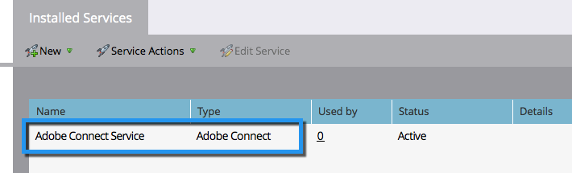

# Ajout d’Adobe Connect en tant que service [!DNL LaunchPoint] {#add-adobe-connect-as-a-launchpoint-service}

Marketo gère votre inscription et votre participation au webinaire Adobe Connect.

>[!NOTE]
>
>**Autorisations d’administrateur requises**

>[!NOTE]
>
>Un abonnement existant à Adobe Connect et des droits d&#39;administration sont nécessaires pour cette étape. Ayez à portée de main les paramètres suivants : nom d’utilisateur, mot de passe, mot de passe du participant et URL du dossier de réunion.

>[!NOTE]
>
>Adobe Connect On Site n’est actuellement pas pris en charge.

1. Accédez à la zone **[!UICONTROL Admin]**.

   

1. Cliquez sur **[!UICONTROL LaunchPoint]**.

   

1. Cliquez sur la liste déroulante **[!UICONTROL New]** et sélectionnez **[!UICONTROL New Service]**.

   

1. Saisissez un **[!UICONTROL Nom d’affichage]**. Sous **[!UICONTROL Service]**, sélectionnez Adobe Connect.

   

1. Saisissez votre **[!UICONTROL Nom d’utilisateur]** et votre **[!UICONTROL Code d’accès]**.

   

1. Terminez le processus en saisissant vos **[!UICONTROL URL de dossier de réunion]** et **[!UICONTROL mot de passe du participant]**, puis cliquez sur **[!UICONTROL Créer]**.

   

   >[!TIP]
   >
   >Lorsque vous créez le mot de passe du participant, la valeur choisie est incluse dans une chaîne de requête lorsque les liens sont envoyés pour l’événement. Nous vous suggérons donc de le rendre convivial.

   >[!NOTE]
   >
   >Une fois que vous êtes connecté à votre compte Adobe Connect, sélectionnez l’onglet **[!UICONTROL Séminaires]** . Sans accéder à aucun séminaire spécifique, copiez l’URL de la barre de votre navigateur dans le paramètre **[!UICONTROL URL du dossier de réunion]** .

Votre service Adobe Connect est maintenant synchronisé avec Marketo !

>[!MORELIKETHIS]
>
>Découvrez comment [créer un événement avec Adobe Connect](/help/marketo/product-docs/demand-generation/events/create-an-event/create-an-event-with-adobe-connect.md){target="_blank"}.
