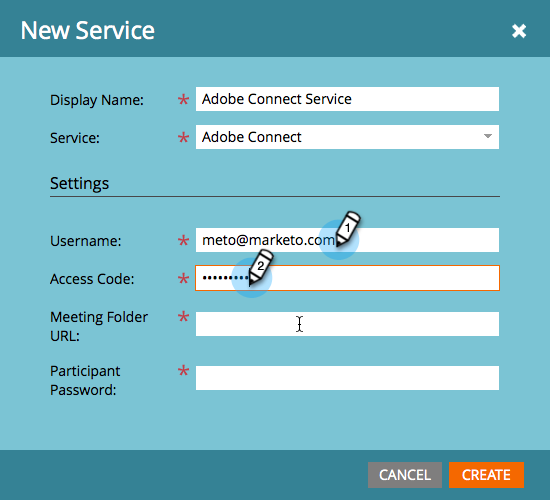
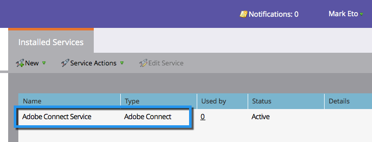

# Ajouter Adobe Connect comme service LaunchPoint {#add-adobe-connect-as-a-launchpoint-service}

Marketo gère votre inscription et votre participation au webinaire Adobe Connect.

>[!NOTE]
>
>**Autorisations d’administrateur requises**

>[!NOTE]
>
>Un abonnement existant aux droits d&#39;Adobe Connect et d&#39;administration est nécessaire pour cette étape. Ayez à portée de main les paramètres suivants : nom d’utilisateur, mot de passe, mot de passe du participant et URL du dossier de la réunion.

>[!NOTE]
>
>Adobe Connect On Site n’est pas pris en charge actuellement.

1. Accédez à **Admin** et cliquez sur **LaunchPoint**.

   

1. Sélectionnez **Nouveau**, puis **Nouveau service**.

   

1. Saisissez un **nom d’affichage**. Sous **Service**, sélectionnez Adobe Connect.

   

1. Entrez votre **nom d&#39;utilisateur** et **code d&#39;accès**.

   

1. Terminez le processus en entrant votre **URL du dossier de réunion** et **mot de passe du participant**, puis cliquez sur **Créer**.

   

   >[!TIP]
   >
   >Lorsque vous créez le mot de passe du participant, la valeur que vous choisissez est incluse dans une chaîne de requête lorsque les liens sont envoyés pour le événement. Donc, nous vous suggérons de le rendre convivial.

   >[!NOTE]
   >
   >Une fois connecté à votre compte Adobe Connect, sélectionnez l’onglet **Séminaires**. Sans accéder à un séminaire spécifique, copiez l’URL de la barre de navigation dans le paramètre **URL du dossier de réunion**.

Votre service Adobe Connect est désormais synchronisé avec Marketo !

>[!MORELIKETHIS]
>
>Découvrez comment [créer un événement avec Adobe Connect](/help/marketo/product-docs/demand-generation/events/create-an-event/create-an-event-with-adobe-connect.md).
