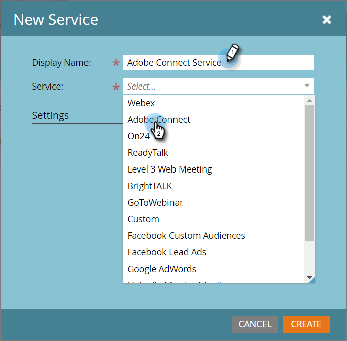

# Ajouter Adobe Connect as a [!DNL LaunchPoint] Service {#add-adobe-connect-as-a-launchpoint-service}

Marketo gère l’inscription et la participation au webinaire Adobe Connect.

>[!NOTE]
>
>**Autorisations d’administration requises**

>[!NOTE]
>
>Un abonnement existant à Adobe Connect et des droits d’administration sont nécessaires pour cette étape. Ayez à portée de main les paramètres suivants : nom d&#39;utilisateur, mot de passe, mot de passe du participant et URL du dossier de réunion.

>[!NOTE]
>
>Adobe Connect On Site n’est actuellement pas pris en charge.

1. Accédez à la zone **[!UICONTROL Admin]**.

   

1. Cliquez sur **[!UICONTROL LaunchPoint]**.

   

1. Cliquez sur le menu déroulant **[!UICONTROL Nouveau]** et sélectionnez **[!UICONTROL Nouveau service]**.

   

1. Saisissez un **[!UICONTROL Nom d’affichage]**. Sous **[!UICONTROL Service]**, sélectionnez Adobe Connect.

   

1. Saisissez vos **[!UICONTROL Nom d’utilisateur]** et **[!UICONTROL Code d’accès]**.

   

1. Terminez le processus en saisissant votre **[!UICONTROL URL du dossier de réunion]** et **[!UICONTROL mot de passe du participant]**, puis cliquez sur **[!UICONTROL Créer]**.

   

   >[!TIP]
   >
   >Lorsque vous créez le mot de passe du participant, la valeur que vous choisissez est incluse dans une chaîne de requête lorsque les liens sont envoyés pour l’événement. Il est suggéré de le rendre convivial vis-à-vis du client.

   >[!NOTE]
   >
   >Après vous être connecté à votre compte Adobe Connect, sélectionnez l’onglet **[!UICONTROL Séminaires]**. Sans entrer dans les détails d&#39;un séminaire en particulier, copiez l&#39;URL de votre barre de navigation dans le paramètre **[!UICONTROL URL du dossier de réunion]**.

Votre service Adobe Connect est maintenant synchronisé avec Marketo.

>[!MORELIKETHIS]
>
>Découvrez comment [créer un événement avec Adobe Connect](/help/marketo/product-docs/demand-generation/events/create-an-event/create-an-event-with-adobe-connect.md){target="_blank"}.
