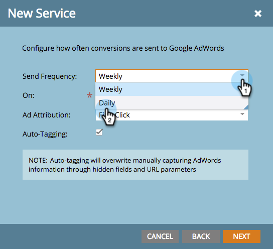

# Ajouter [!DNL Google AdWords] en tant que service [!DNL Launchpoint] avec un compte de gestionnaire {#add-google-adwords-as-a-launchpoint-service-with-a-manager-account}

Liez votre compte [!DNL Google AdWords] à Marketo pour télécharger automatiquement les données de conversion hors ligne de Marketo vers [!DNL Google AdWords]. Ensuite, à partir de l’interface utilisateur [!DNL AdWords], vous pourrez facilement voir quels clics ont généré des prospects qualifiés, des opportunités et de nouveaux clients (ou toute étape de recettes dont vous souhaitez effectuer le suivi) après avoir [&#x200B; ajouté des colonnes personnalisées](https://support.google.com/adwords/answer/3073556){target="_blank"} dans [!DNL AdWords]. Ces informations n’apparaissent pas dans l’interface utilisateur de Marketo.

Si vous disposez de plusieurs comptes [!DNL Google Adwords], vous pouvez utiliser un [[!DNL Google AdWords Manager Account]](https://www.google.com/adwords/manager-accounts/){target="_blank"} (anciennement appelé [!DNL My Client Center]) pour les intégrer à Marketo.

En savoir plus sur la [fonctionnalité d’importation de conversion hors ligne de Google](https://support.google.com/adwords/answer/2998031?hl=en){target="_blank"}.

>[!AVAILABILITY]
>
>Tous les utilisateurs de Marketo Engage n’ont pas acheté cette fonctionnalité. Pour plus d’informations, contactez l’équipe du compte d’Adobe (votre gestionnaire de compte).

>[!NOTE]
>
>**Autorisations d’administrateur requises**

>[!NOTE]
>
>Vous pouvez également intégrer un compte [autonome [!DNL Google AdWords] en tant que  [!DNL Launchpoint] service](/help/marketo/product-docs/administration/additional-integrations/add-google-adwords-as-a-launchpoint-service.md){target="_blank"}.

1. Accédez à la zone **[!UICONTROL Admin]**.

   

1. Sélectionnez **[!UICONTROL LaunchPoint]**.

   

1. Cliquez sur la liste déroulante **[!UICONTROL New]** et sélectionnez **[!UICONTROL New Service]**.

   

1. Saisissez un **[!UICONTROL Nom d’affichage]** et sélectionnez **[!UICONTROL Google AdWords]**.

   

1. Sélectionnez **[!UICONTROL Autoriser Marketo]**.

   >[!NOTE]
   >
   >Veillez à vous déconnecter de votre compte personnel [!DNL Gmail] et à activer les fenêtres contextuelles.

   

1. Sélectionnez votre compte associé à **[!DNL Google AdWords]**.

   

1. Cliquez sur **[!UICONTROL Accepter]**.

   

1. L’état s’affiche comme **[!UICONTROL Success]**. Sélectionnez **[!UICONTROL Suivant]**.

   

1. Transférez vos conversions hors ligne de Marketo vers [!DNL Google AdWords] **[!UICONTROL Hebdomadaire]** ou **[!UICONTROL Quotidien]**.

   

1. Conversion des attributs en **[!UICONTROL Premier clic]** ou **[!UICONTROL Dernier clic]**.

   

   | Type | Définition |
   |---|---|
   | [!UICONTROL Premier clic] | Les conversions hors ligne seront attribuées à la première publicité [!DNL AdWords] sur laquelle une personne a cliqué au cours des 90 derniers jours. |
   | [!UICONTROL Dernier clic] | Les conversions hors ligne seront attribuées à la dernière publicité [!DNL AdWords] ayant fait l’objet d’un clic par une personne. |

   >[!NOTE]
   >
   >[Le balisage automatique](https://support.google.com/adwords/answer/1752125?hl=en){target="_blank"} doit être sélectionné pour que cette fonctionnalité fonctionne. Elle doit être activée dans [!DNL AdWords].

1. Cliquez sur **[!UICONTROL Suivant]**.

   

1. Désélectionnez les comptes à mettre à jour. Cliquez sur **[!UICONTROL Créer]**.

   

   Consultez maintenant l’article connexe ci-dessous pour savoir comment mapper [!DNL AdWords] conversions hors ligne dans votre modèle de revenu.

   >[!MORELIKETHIS]
   >
   >[Définir [!DNL Google AdWords] des conversions dans le modèle de revenu avec un compte de gestionnaire](/help/marketo/product-docs/reporting/revenue-cycle-analytics/revenue-cycle-models/set-google-adwords-conversions-in-the-revenue-model-with-a-manager-account.md){target="_blank"}
