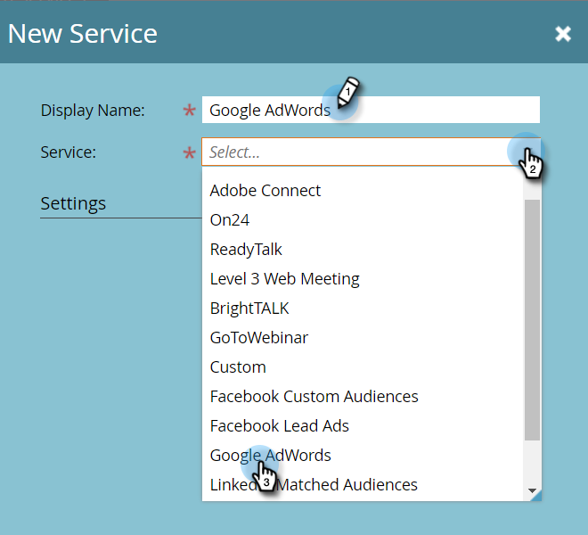

# Ajout de Google AdWords en tant que service Launch avec un compte de gestionnaire {#add-google-adwords-as-a-launchpoint-service-with-a-manager-account}

Liez votre compte Google AdWords à Marketo pour charger automatiquement les données de conversion hors ligne de Marketo vers Google AdWords. Ensuite, à partir de l’interface utilisateur d’AdWords, vous pourrez facilement identifier les clics qui ont généré des prospects qualifiés, des opportunités et de nouveaux clients (ou toute étape de recettes dont vous souhaitez effectuer le suivi) après avoir effectué vos recherches.  [ajout de colonnes personnalisées](https://support.google.com/adwords/answer/3073556){target="_blank"} dans AdWords. Ces informations n’apparaissent pas dans l’interface utilisateur de Marketo.

Si vous disposez de plusieurs comptes Google AdWords, vous pouvez utiliser une variable [Compte Google AdWords Manager](https://www.google.com/adwords/manager-accounts/){target="_blank"} (anciennement appelé My Client Center) pour les intégrer à Marketo.

En savoir plus sur [Fonctionnalité d’importation de conversion hors ligne Google](https://support.google.com/adwords/answer/2998031?hl=en){target="_blank"}.

>[!AVAILABILITY]
>
>Tous les clients n’ont pas acheté cette fonctionnalité. Pour plus d’informations, contactez l’équipe de compte d’Adobe (votre gestionnaire de compte).

>[!NOTE]
>
>**Autorisations d’administrateur requises**

>[!NOTE]
>
>Vous pouvez également intégrer une [compte Google AdWords autonome en tant que service LaunchPoint](/help/marketo/product-docs/administration/additional-integrations/add-google-adwords-as-a-launchpoint-service.md){target="_blank"}.

1. Accédez au **Administration** .

   

1. Sélectionner **LaunchPoint**.

   

1. Cliquez sur le bouton **Nouveau** et sélectionnez **Nouveau service**.

   

1. Saisissez un nom d’affichage et sélectionnez **Google AdWords**.

   

1. Sélectionner **Autoriser Marketo**.

   >[!NOTE]
   >
   >Veillez à vous déconnecter de votre compte Gmail personnel et à activer les fenêtres contextuelles.

   

1. Sélectionnez votre compte associé à **Google AdWords**.

   

1. Cliquez sur **Accepter**.

   

1. L’état s’affiche comme **Succès**. Sélectionner **Suivant**.

   

1. Chargement des conversions hors ligne de Marketo vers Google AdWords **Hebdomadaire** ou **Quotidien**.

   

1. Conversion des attributs en **Premier clic** ou **Dernier clic**.

   

   | Type | Définition |
   |---|---|
   | Premier clic | Les conversions hors ligne seront attribuées à la première publicité AdWords sur laquelle une personne a cliqué au cours des 90 derniers jours. |
   | Dernier clic | Les conversions hors ligne sont attribuées à la dernière publicité AdWords sur laquelle une personne a cliqué. |

   >[!NOTE]
   >
   >[Balisage automatique](https://support.google.com/adwords/answer/1752125?hl=en){target="_blank"} doit être sélectionné pour que cette fonction fonctionne. Elle doit être activée dans AdWords.

1. Cliquez sur **Suivant**.

   

1. Désélectionnez les comptes que vous ne souhaitez pas mettre à jour. Cliquez sur **Créer**.

   

   Consultez maintenant l’article connexe ci-dessous pour savoir comment mapper les conversions hors ligne AdWords dans votre modèle de revenu.

   >[!MORELIKETHIS]
   >
   >[Définir des conversions Google AdWords dans le modèle de revenu avec un compte de gestionnaire](/help/marketo/product-docs/reporting/revenue-cycle-analytics/revenue-cycle-models/set-google-adwords-conversions-in-the-revenue-model-with-a-manager-account.md){target="_blank"}
