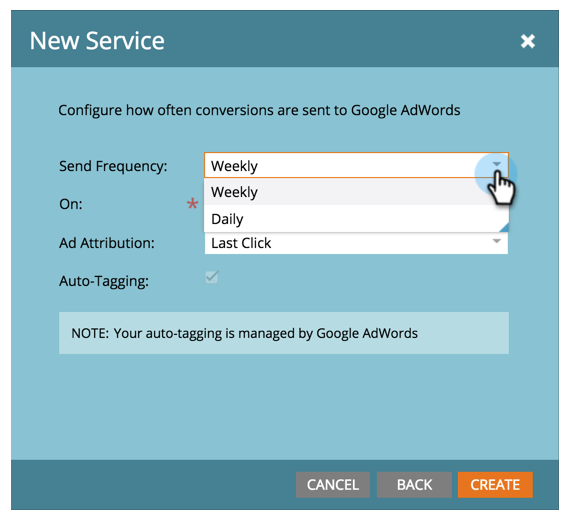
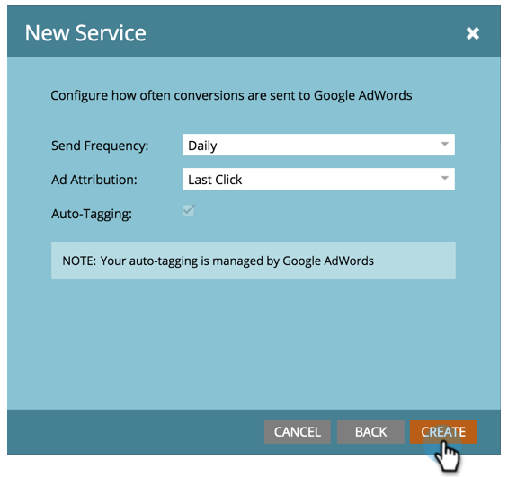

# Ajouter [!DNL Google AdWords] as a [!DNL LaunchPoint] Service {#add-google-adwords-as-a-launchpoint-service}

Liez votre compte [!DNL Google AdWords] à Marketo pour charger automatiquement les données de conversion hors ligne de Marketo vers [!DNL Google AdWords]. Ensuite, à partir de l’interface utilisateur de [!DNL AdWords], vous pourrez facilement voir quels clics ont donné lieu à des leads qualifiés, à des opportunités et à de nouveaux clients (ou à toute étape de chiffre d’affaires que vous souhaitez suivre) après avoir [ajouté des colonnes personnalisées](https://support.google.com/adwords/answer/3073556){target="_blank"} dans [!DNL AdWords]. Ces informations n’apparaissent pas dans l’interface utilisateur de Marketo.

En savoir plus sur la fonctionnalité d’importation de conversions hors ligne de [Google](https://support.google.com/adwords/answer/2998031?hl=en){target="_blank"}.

>[!AVAILABILITY]
>
>Tous les utilisateurs de Marketo Engage n’ont pas acheté cette fonctionnalité. Pour plus d’informations, contactez l’équipe du compte Adobe (votre gestionnaire de compte).

>[!NOTE]
>
>**Autorisations d’administration requises**

>[!NOTE]
>
>Vous pouvez également intégrer un [[!DNL Google AdWords] as a [!DNL Launchpoint] service à un compte Manager](/help/marketo/product-docs/administration/additional-integrations/add-google-adwords-as-a-launchpoint-service-with-a-manager-account.md){target="_blank"}.

1. Accédez à la zone **[!UICONTROL Admin]**.

   

1. Sélectionnez **[!UICONTROL LaunchPoint]**.

   

1. Sélectionnez **[!UICONTROL Nouveau]** et **[!UICONTROL Nouveau service]**.

   

1. Saisissez un [!UICONTROL nom d’affichage] et sélectionnez **[!UICONTROL Google AdWords]**.

   

1. Sélectionnez **[!UICONTROL Autoriser Marketo]**.

   >[!NOTE]
   >
   >Veillez à vous déconnecter de votre compte [!DNL Gmail] personnel et à activer les fenêtres pop-up.

   

1. Sélectionnez le compte associé à [!DNL Google AdWords].

   

1. Sélectionnez **[!UICONTROL Accepter]**.

   

1. Le statut s’affiche sous la forme **[!UICONTROL Succès]**. Sélectionnez **[!UICONTROL Suivant]**.

   

1. Chargez vos conversions hors ligne de Marketo vers [!DNL Google AdWords] **[!UICONTROL Hebdomadaire]** ou **[!UICONTROL Quotidien]**.

   

1. Conversion des attributs en **[!UICONTROL Premier clic]** ou **[!UICONTROL Dernier clic]**.

   

   | Type | Définition |
   |---|---|
   | [!UICONTROL Premier clic] | Les conversions hors ligne seront attribuées à la première publicité [!DNL AdWords] sur laquelle une personne a cliqué au cours des 90 derniers jours |
   | [!UICONTROL Dernier clic] | Les conversions hors ligne seront attribuées à la dernière publicité [!DNL AdWords] sur laquelle une personne a cliqué |

   >[!NOTE]
   >
   >L’utilisation d’un modèle d’attribution cohérent dans Marketo et [!DNL AdWords] fournit les données les plus précises.

1. Cliquez sur **[!UICONTROL Créer]**.

   

   >[!NOTE]
   >
   >[Balisage automatique](https://support.google.com/adwords/answer/1752125?hl=en){target="_blank"} doit être sélectionné pour que cette fonctionnalité fonctionne. La désactivation doit être effectuée dans [!DNL AdWords].

Fantastique ! Consultez maintenant l’article connexe ci-dessous pour savoir comment mapper [!DNL AdWords] conversions hors ligne dans votre modèle de chiffre d’affaires.

>[!MORELIKETHIS]
>
>[Set [!DNL Google AdWords] Conversions dans le modèle de revenu](/help/marketo/product-docs/reporting/revenue-cycle-analytics/revenue-cycle-models/set-google-adwords-conversions-in-the-revenue-model.md){target="_blank"}
