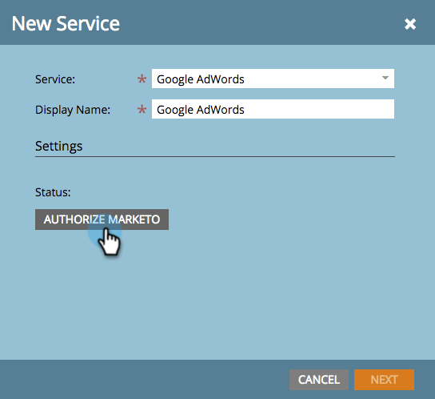
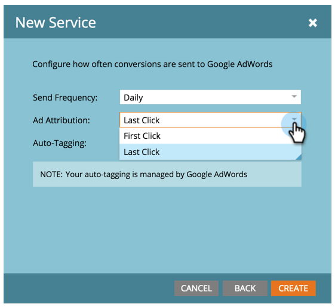

# Ajouter [!DNL Google AdWords] as a [!DNL LaunchPoint] Service {#add-google-adwords-as-a-launchpoint-service}

Liez vos [!DNL Google AdWords] compte vers Marketo pour charger automatiquement les données de conversion hors ligne de Marketo vers [!DNL Google AdWords]. Ensuite, à partir du [!DNL AdWords] Une fois que vous aurez effectué le suivi des clics, vous pourrez identifier facilement les prospects qualifiés, les opportunités et les nouveaux clients (ou quelles que soient les phases de recettes). [ajout de colonnes personnalisées](https://support.google.com/adwords/answer/3073556){target="_blank"} in [!DNL AdWords]. Ces informations n’apparaissent pas dans l’interface utilisateur de Marketo.

En savoir plus sur [Fonctionnalité d’importation de conversion hors ligne Google](https://support.google.com/adwords/answer/2998031?hl=en){target="_blank"}.

>[!AVAILABILITY]
>
>Tous les utilisateurs de Marketo Engage n’ont pas acheté cette fonctionnalité. Pour plus d’informations, contactez l’équipe du compte d’Adobe (votre gestionnaire de compte).

>[!NOTE]
>
>**Autorisations d’administrateur requises**

>[!NOTE]
>
>Vous pouvez également intégrer une [[!DNL Google AdWords] as a [!DNL Launchpoint] service avec un compte manager](/help/marketo/product-docs/administration/additional-integrations/add-google-adwords-as-a-launchpoint-service-with-a-manager-account.md){target="_blank"}.

1. Cliquez sur l&#39;icône **[!UICONTROL Admin]**.

   

1. Sélectionner **[!UICONTROL LaunchPoint]**.

   

1. Sélectionner **[!UICONTROL Nouveau]** et **[!UICONTROL Nouveau service]**.

   

1. Saisissez un [!UICONTROL nom d&#39;affichage] et sélectionnez **[!UICONTROL Google AdWords]**.

   

1. Sélectionner **[!UICONTROL Autoriser Marketo]**.

   >[!NOTE]
   >
   >Veillez à vous déconnecter de votre compte personnel. [!DNL Gmail] et activez les fenêtres contextuelles.

   

1. Sélectionnez votre compte associé à [!DNL Google AdWords].

   

1. Sélectionner **[!UICONTROL Accepter]**.

   

1. L’état s’affiche comme **[!UICONTROL Succès]**. Sélectionner **[!UICONTROL Suivant]**.

   

1. Chargement des conversions hors ligne de Marketo vers [!DNL Google AdWords] **[!UICONTROL Hebdomadaire]** ou **[!UICONTROL Qualité]**.

   

1. Conversion des attributs en **[!UICONTROL Premier clic]** ou **[!UICONTROL Dernier clic]**.

   

   | Type | Définition |
   |---|---|
   | [!UICONTROL Premier clic] | Les conversions hors ligne seront attribuées au premier [!DNL AdWords] publicité sur laquelle une personne a cliqué au cours des 90 derniers jours |
   | [!UICONTROL Dernier clic] | Les conversions hors ligne seront attribuées au dernier [!DNL AdWords] publicité sur laquelle a cliqué une personne |

   >[!NOTE]
   >
   >Utilisation d’un modèle d’attribution cohérent dans Marketo et [!DNL AdWords] fournit les données les plus précises.

1. Cliquez sur **[!UICONTROL Créer]**.

   

   >[!NOTE]
   >
   >[Balisage automatique](https://support.google.com/adwords/answer/1752125?hl=en){target="_blank"} doit être sélectionné pour que cette fonction fonctionne. La désactivation doit être effectuée à l’intérieur [!DNL AdWords].

Fantastique ! Consultez maintenant l’article connexe ci-dessous pour savoir comment mapper [!DNL AdWords] conversions hors ligne dans votre modèle de revenu.

>[!MORELIKETHIS]
>
>[Définir [!DNL Google AdWords] Conversions dans le modèle de revenu](/help/marketo/product-docs/reporting/revenue-cycle-analytics/revenue-cycle-models/set-google-adwords-conversions-in-the-revenue-model.md){target="_blank"}
