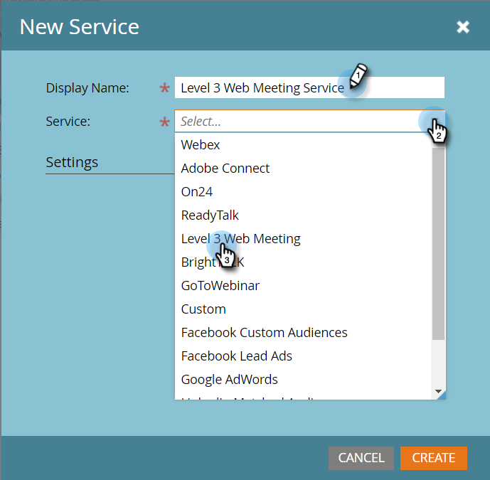
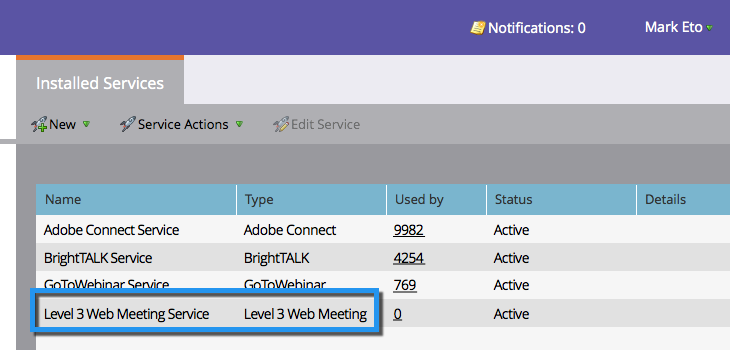

# Ajouter la réunion Web de niveau 3 en tant que service LaunchPoint {#add-level-web-meeting-as-a-launchpoint-service}

Marketo gère votre inscription et votre participation à votre réunion Web de niveau 3.

>[!NOTE]
>
>**Autorisations d’administrateur requises**

>[!NOTE]
>
>**Rappel**
>
>Un abonnement existant à la réunion Web de niveau 3 et des droits d&#39;administration sont nécessaires pour cette étape. Ayez à portée de main votre numéro d&#39;accès, votre code d&#39;accès et votre mot de passe.

1. Accédez à **Admin** et sélectionnez **LaunchPoint**.

   

1. Sélectionnez **Nouveau** , puis **Nouveau** **service**.

   

1. Saisissez un **nom** **d’affichage**. Sous **Service**, sélectionnez Réunion **Web de** niveau 3.

   

1. Saisissez votre **numéro** d&#39; **accès****, votre** code d&#39;accès **et votre code de passe, puis cliquez sur Créer.**********

   

1. Phénoménal ! Votre compte de réunion Web** de niveau 3 est désormais synchronisé avec Marketo.

   

>[!MORELIKETHIS]
>
>Découvrez comment [créer un événement avec une réunion](../../../product-docs/demand-generation/events/create-an-event/create-an-event-with-level-3-web-meeting.md)Web de niveau 3.

