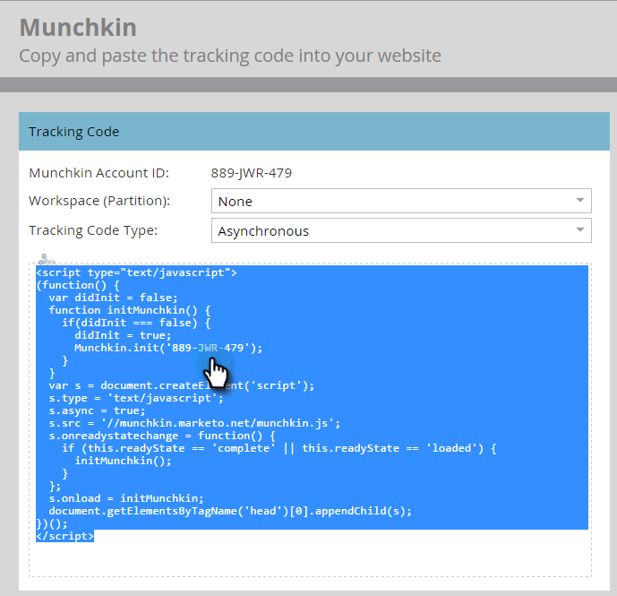

# Ajouter le code de suivi Munchkin sur votre site Web {#add-munchkin-tracking-code-to-your-website}

Le code de suivi JavaScript personnalisé de Marketo, appelé Munchkin, suit toutes les personnes qui visitent votre site Web afin que vous puissiez réagir à leurs visites à l’aide de campagnes marketing automatisées. Même les visiteurs anonymes sont suivis avec leurs adresses IP et d&#39;autres informations. ** Sans ce code de suivi, vous ne pourrez pas suivre les visites ou autres activités sur votre site Web !**

>[!NOTE]
>
>**Conditions préalables**
>
>Assurez-vous d’avoir accès à un développeur JavaScript expérimenté. L’assistance technique de Marketo n’est pas configurée pour vous aider à résoudre les problèmes liés à JavaScript personnalisé.

## Ajouter le code de suivi sur votre site Web {#add-tracking-code-to-your-website}

>[!NOTE]
>
>Les clients Adobe Experience Cloud peuvent également utiliser l’intégration de Marketo dans le lancement d’Adobe pour inclure le script Munchkin dans leurs pages Web. Obtenez l&#39;application [ici](https://www.adobeexchange.com/experiencecloud.details.101054.html).

1. Accédez à **Admin** et cliquez sur **Munchkin** dans l’arborescence de gauche.

   

   Sélectionnez Asynchrone pour le type de code de suivi.

   

   >[!NOTE]
   >
   >Dans la plupart des cas, vous devez utiliser le code asynchrone. [En savoir plus.](#types-of-munchkin-tracking-codes)

   Cliquez sur et copiez le code de suivi JavaScript à placer sur votre site Web.

   

   >[!CAUTION]
   >
   >N’utilisez pas le code affiché dans cette capture d’écran. Vous devez utiliser le code unique qui s’affiche dans votre compte !

   >[!TIP]
   >
   >Placez le code de suivi sur les pages Web dont vous souhaitez effectuer le suivi. Il peut s&#39;agir de chaque page de petits sites, ou uniquement des pages clés des sites qui comportent de nombreuses pages Web générées de manière dynamique, des forums d&#39;utilisateurs, etc.

   Pour un résultat optimal, utilisez le code Munchkin asynchrone et placez-le dans les `<head>` éléments de vos pages. Si vous utilisez le code simple (non recommandé), il se trouve juste avant la `</body>` balise .
   

>[!TIP]
>
>Pour les sites qui enregistrent un trafic élevé (des centaines de milliers de visites par mois, par exemple), nous vous recommandons de ne pas suivre les personnes anonymes. [En savoir plus.](http://developers.marketo.com/documentation/websites/lead-tracking-munchkin-js/)

## Ajouter le code de suivi lors de l’utilisation de plusieurs espaces de travail {#add-tracking-code-when-using-multiple-workspaces}

Si vous utilisez des espaces de travail dans votre compte Marketo, vous disposez probablement également de présences Web distinctes qui correspondent à vos espaces de travail. Dans ce cas, vous pouvez utiliser le code JavaScript de suivi Munchkin pour affecter vos personnes anonymes à l&#39;espace de travail et à la partition appropriés.

1. Accédez à Admin et cliquez sur Munchkin dans l’arborescence à gauche.

1. Sélectionnez l’espace de travail approprié pour les pages Web dont vous souhaitez effectuer le suivi.

>[!NOTE]
>
>Si vous n&#39;utilisez pas le code Munchkin de l&#39;espace de travail spécial, les utilisateurs seront affectés à la partition par défaut créée lors de la configuration de votre compte. Il s’appelle initialement &quot;Par défaut&quot;, mais vous avez peut-être modifié cela dans votre propre compte Marketo.

1. Sélectionnez Asynchrone pour le type de code de suivi.

   

1. Cliquez sur et copiez le code de suivi JavaScript à placer sur votre site Web.

>[!CAUTION]
>
>N’utilisez pas le code affiché dans cette capture d’écran. Vous devez utiliser le code unique qui s’affiche dans votre compte !

1. Placez le code de suivi sur vos pages Web dans l’ `<head>` élément. Les nouvelles personnes qui visitent cette page seront affectées à cette partition.

>[!CAUTION]
>
>Vous ne pouvez utiliser qu&#39;un seul script de suivi Munchkin pour une partition et un espace de travail uniques sur une page. N&#39;incluez pas de scripts de suivi pour plusieurs partitions/espaces de travail sur votre site Web.

>[!NOTE]
>
>Les landings page créés dans Marketo contiennent automatiquement du code de suivi, vous n’avez donc pas besoin de placer ce code dessus.

## Types de codes de suivi Munchkin {#types-of-munchkin-tracking-codes}

Vous pouvez choisir parmi 3 types de codes de suivi Munchkin. Chacune a un impact différent sur le temps de chargement de la page Web.

1. **Simple**: comporte le moins de lignes de code, mais n’optimise pas le temps de chargement des pages Web. Ce code charge la bibliothèque jQuery chaque fois qu’une page Web est chargée.
1. **Asynchrone**: réduit le temps de chargement des pages Web.
1. **jQuery** asynchrone : réduit le temps de chargement des pages Web et améliore également les performances du système. Ce code suppose que vous disposez déjà de jQuery et ne vérifie pas son chargement.

## Testez si votre code Munchkin fonctionne {#test-if-your-munchkin-code-is-working}

Pour vérifier que votre code Munchkin fonctionne après l&#39;avoir ajouté :

1. Visitez votre page Web.
1. Accédez à **Analytics**.

   

1. Cliquez sur Activité **de page** Web.

   

1. Cliquez sur l’onglet **Configuration** , cliquez en doublon sur la source **** d’Activité, puis modifiez-la en Visiteurs **anonymes (y compris les FAI)**.

   

   

1. Cliquez sur l’onglet **Rapport** . Si vous ne voyez aucune donnée, patientez quelques minutes, puis cliquez sur l’icône Actualiser en bas.

