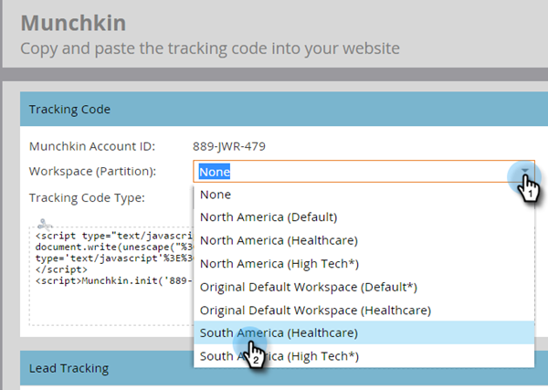

# Ajout de [!DNL Munchkin] code de suivi à votre site web {#add-munchkin-tracking-code-to-your-website}

Le code de suivi JavaScript personnalisé de Marketo, appelé [!DNL Munchkin], effectue le suivi de toutes les personnes qui visitent votre site web afin que vous puissiez réagir à leurs visites à l’aide de campagnes marketing automatisées. Même les visiteurs anonymes sont suivis avec leurs adresses IP et d’autres informations. **Sans ce code de suivi, vous ne pourrez pas suivre les visites ou d’autres activités sur votre site web** !

>[!PREREQUISITES]
>
>Vérifiez que vous avez accès à un développeur JavaScript expérimenté. Le support technique de Marketo n’est pas configuré pour vous aider à résoudre les problèmes liés à JavaScript personnalisé.

## Ajout du code de suivi à votre site web {#add-tracking-code-to-your-website}

>[!NOTE]
>
>Les utilisateurs de Adobe Experience Cloud peuvent également utiliser l’ [intégration Marketo dans Adobe Launch](https://exchange.adobe.com/apps/ec/100223/adobe-launch-core-extension){target="_blank"} pour inclure le script [!DNL Munchkin] sur leurs pages web. Si vous utilisez Adobe Launch, _le script [!DNL Munchkin] est ajouté automatiquement_, vous n’avez donc pas besoin de l’ajouter vous-même.

1. Accédez à la zone **[!UICONTROL Admin]**.

   

1. Cliquez sur **[!UICONTROL Munchkin]**.

   

1. Sélectionnez **[!UICONTROL Asynchrone]** pour **[!UICONTROL Type de code de suivi]**.

   

   >[!NOTE]
   >
   >Dans la plupart des cas, vous devez utiliser le code asynchrone. [En savoir plus](#types-of-munchkin-tracking-codes).

1. Cliquez sur et copiez le code de suivi JavaScript à placer sur votre site web.

   

   >[!CAUTION]
   >
   >N’utilisez pas le code affiché dans cette capture d’écran. Vous devez utiliser le code unique qui apparaît dans votre compte.

   >[!TIP]
   >
   >Placez le code de suivi sur les pages Web dont vous souhaitez effectuer le suivi. Il peut s’agir de toutes les pages des petits sites ou uniquement des pages clés des sites qui comportent de nombreuses pages Web générées dynamiquement, des forums d’utilisateurs, etc.

   Pour de meilleurs résultats, utilisez le code asynchrone [!DNL Munchkin] et placez-le dans les éléments `<head>` de vos pages. Si vous utilisez le code simple (non recommandé), il se trouve juste avant la balise `</body>` .

   

   >[!TIP]
   >
   >Pour les sites dont le trafic est important (des centaines de milliers de visites par mois, par exemple), nous vous recommandons de ne pas suivre les personnes anonymes. [En savoir plus](https://experienceleague.adobe.com/en/docs/marketo-developer/marketo/javascriptapi/lead-tracking/){target="_blank"}.

## Ajout d’un code de suivi lors de l’utilisation de plusieurs espaces de travail {#add-tracking-code-when-using-multiple-workspaces}

Si vous utilisez des espaces de travail dans votre compte Marketo, il est probable que vous ayez également des présences web distinctes qui correspondent à vos espaces de travail. Dans ce cas, vous pouvez utiliser le code JavaScript de suivi [!DNL Munchkin] pour affecter vos personnes anonymes à l’espace de travail et à la partition appropriés.

1. Accédez à la zone **[!UICONTROL Admin]**.

   

1. Cliquez sur **[!UICONTROL Munchkin]**.

   

1. Sélectionnez l’espace de travail approprié pour les pages Web dont vous souhaitez effectuer le suivi.

   

   >[!NOTE]
   >
   >Si vous n&#39;utilisez pas le code [!DNL Munchkin] de l&#39;espace de travail spécial, les personnes seront affectées à la partition par défaut qui a été créée lors de la configuration de votre compte. Il s’appelle initialement &quot;[!UICONTROL Default]&quot;, mais vous avez peut-être modifié cela dans votre propre compte Marketo.

1. Sélectionnez **[!UICONTROL Asynchrone]** pour **[!UICONTROL Type de code de suivi]**.

   

1. Cliquez sur et copiez le code de suivi JavaScript à placer sur votre site web.

   

   >[!CAUTION]
   >
   >N’utilisez pas le code affiché dans cette capture d’écran. Vous devez utiliser le code unique qui apparaît dans votre compte.

1. Placez le code de suivi sur vos pages web dans l’élément `<head>` . Les nouvelles personnes qui visitent cette page seront affectées à cette partition.

   

   >[!CAUTION]
   >
   >Vous ne pouvez utiliser qu’un seul script de suivi [!DNL Munchkin] pour une partition unique et un espace de travail sur une page. N’incluez pas de scripts de suivi pour plusieurs partitions/espaces de travail sur votre site web.

   >[!NOTE]
   >
   >Les landing pages créées dans Marketo contiennent automatiquement du code de suivi. Vous n’avez donc pas besoin de placer ce code dessus.

## Types de codes de suivi [!DNL Munchkin] {#types-of-munchkin-tracking-codes}

Vous pouvez choisir trois types de codes de suivi [!DNL Munchkin]. Chacune a un impact différent sur les temps de chargement de la page web.

1. **[!UICONTROL Simple]** : comporte le moins de lignes de code, mais n’optimise pas le temps de chargement des pages web. Ce code charge la bibliothèque jQuery chaque fois qu’une page web est chargée.
1. **[!UICONTROL Asynchrone]** : réduit le temps de chargement des pages web.
1. **[!UICONTROL jQuery asynchrone]** : réduit le temps de chargement des pages web et améliore également les performances du système. Ce code suppose que vous disposez déjà de jQuery et ne vérifie pas son chargement.

## Test si votre code [!DNL Munchkin] fonctionne {#test-if-your-munchkin-code-is-working}

Pour vérifier que votre code [!DNL Munchkin] fonctionne après l’avoir ajouté :

1. Visitez votre page web.

1. Dans votre [!DNL My Marketo], cliquez sur la mosaïque **[!UICONTROL Analytics]** .

   

1. Cliquez sur **[!UICONTROL Activité de page web]**.

   

1. Cliquez sur l’onglet **[!UICONTROL Configuration]**, double-cliquez sur **[!UICONTROL Activity Source]**.

   

1. Remplacez [!UICONTROL Activity Source] par **[!UICONTROL Visiteurs anonymes (y compris FAI)]** et cliquez sur **[!UICONTROL Appliquer]**.

   

1. Cliquez sur l’onglet **[!UICONTROL Rapport]** .

   

   >[!NOTE]
   >
   >Si vous ne voyez aucune donnée, patientez quelques minutes, puis cliquez sur l’icône d’actualisation en bas de la page.
