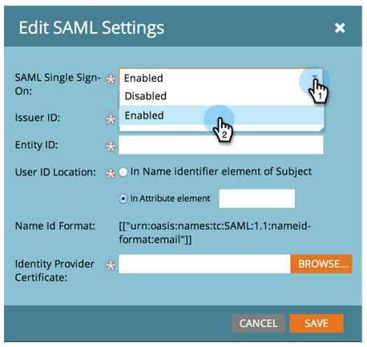

# Ajouter la connexion unique à un portail {#add-single-sign-on-to-a-portal}

Si vous disposez d’un service d’annuaire qui authentifie les utilisateurs, vous pouvez autoriser l’authentification unique (SSO) dans Marketo. Nous prenons en charge cette fonctionnalité en utilisant le langage SAML (Security Assertion Markup Language) version 2.0 et ultérieure.

Marketo fonctionne en tant que Prestataire SAML (SP) et dépend d’un fournisseur d’identité externe (IdP) pour authentifier les utilisateurs.

Une fois l’authentification unique activée, l’IdP peut valider les informations d’identification d’un utilisateur. Lorsqu’un utilisateur souhaite utiliser le logiciel Marketo, l’IdP envoie alors un message SAML signé à Marketo, agissant en tant que SP. Ce message garantit à Marketo que l&#39;utilisateur est autorisé à utiliser le logiciel Marketo.

>[!NOTE]
>
>**Autorisations d’administrateur requises**

>[!NOTE]
>
>Êtes-vous un utilisateur Microsoft Azure ? Consultez leur [didacticiel d&#39;intégration](https://azure.microsoft.com/en-us/documentation/articles/active-directory-saas-marketo-tutorial/).

## Comment envoyer la requête {#how-to-send-the-request}

* Envoyer la demande d’authentification unique, qui est une réponse SAML, à `https://login.marketo.com/saml/assertion/<your-munchkin-id>`
* En tant qu’URL d’Audience du SP. Utiliser `https://saml.marketo.com/sp`
* Si vous utilisez l&#39;attribut SPNameQualifier, définissez l&#39;élément NameID pour Objet sur `https://saml.marketo.com/sp`
* Si vous fédérez plusieurs abonnements Marketo au même fournisseur d’authentification unique, vous pouvez utiliser des url SP uniques pour chaque sous-fournisseur Marketo au format `https://saml.marketo.com/sp/<munchkin_id>`

>[!NOTE]
>
>Marketo ne prend en charge que le fournisseur d’identité (également appelé IdP-started), dans lequel l’utilisateur lance d’abord la page de connexion Idp, s’authentifie, puis accède à Mon Marketo.

## Notes supplémentaires {#additional-notes}

* **Temps**  de synchronisation : pour un nouvel utilisateur, un délai d’environ 10 minutes est nécessaire avant le traitement d’une demande d’authentification unique initiale.
* **Approvisionnement**  des utilisateurs : les utilisateurs sont configurés manuellement par Marketo.
* **Autorisation**  - Les autorisations d’utilisateur sont conservées dans Marketo.
* **Prise en charge**  OAuth : Marketo ne prend pas actuellement en charge OAuth.
* **Propagation**  automatique de l’utilisateur - Également appelé &quot;Approvisionnement juste à temps&quot;, c’est-à-dire lorsque la première connexion SAML d’un utilisateur est capable de créer l’utilisateur dans l’application Web à laquelle il accède (Marketo, par exemple) et qu’aucune action d’administration manuelle n’est requise. Pour le moment, Marketo ne le soutient pas.
* **Chiffrement**  : Marketo ne prend pas actuellement en charge le chiffrement.

>[!NOTE]
>
>Avant de commencer, procurez-vous votre certificat de fournisseur d’identité au format X.509 et dans l’extension .crt, .der ou .cer.

## Mettre à jour les paramètres SAML {#update-saml-settings}

La fonction SSO est désactivée par défaut. Suivez ces étapes pour activer SAML et le configurer.

1. Accédez à **Admin** et cliquez sur **Connexion unique**.

   

   >[!NOTE]
   >
   >Si **Connexion unique** n&#39;apparaît pas sous **Admin**, contactez le [Support Marketo](https://nation.marketo.com/t5/Support/ct-p/Support).

1. Sous la section **Paramètres SAML**, cliquez sur **Modifier**.

   

1. Remplacez **Connexion unique SAML** par **Activé**.

   

1. Saisissez votre **ID d’émetteur**, **ID d’entité**, sélectionnez **Emplacement de l’ID d’utilisateur**, puis cliquez sur **Parcourir**.

   

1. Sélectionnez votre fichier **Certificat du fournisseur d&#39;identité**.

   

1. Cliquez sur **Enregistrer**.

   

## Mettre à jour les paramètres de page de redirection {#update-redirect-page-settings}

1. Sous la section **Rediriger les pages**, cliquez sur **Modifier**.

   

   >[!NOTE]
   >
   >Les clients qui utilisent un ID universel avec une authentification unique doivent saisir l’URL de connexion du fournisseur d’identité dans le champ **URL de connexion**.

1. Saisissez une **URL de déconnexion**. Il s’agit de l’URL à laquelle l’utilisateur doit être redirigé lorsqu’il se déconnecte de Marketo.

   

1. Saisissez une **URL d’erreur**. Il s’agit de l’URL à laquelle l’utilisateur doit être redirigé en cas d’échec de connexion à Marketo. Cliquez sur **Enregistrer**.

   

   >[!NOTE]
   >
   >Ces deux pages doivent être accessibles au public.

>[!MORELIKETHIS]
>
>* [Utilisation d’un ID universel pour la connexion à un Abonnement](/help/marketo/product-docs/administration/settings/using-a-universal-id-for-subscription-login.md)
>* [Limiter la connexion de l&#39;utilisateur aux connexions par signature unique](/help/marketo/product-docs/administration/additional-integrations/restrict-user-login-to-sso-only.md)
>* [Invitation d’utilisateurs Marketo à deux instances avec un identifiant universel](https://nation.marketo.com/t5/Knowledgebase/Inviting-Marketo-Users-to-Two-Instances-with-Universal-ID-UID/ta-p/251122)

