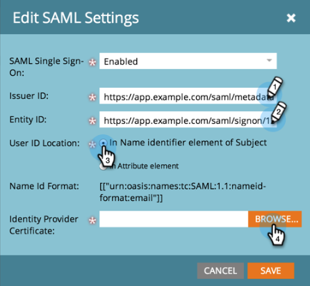

# Ajout d’une authentification unique à un portail {#add-single-sign-on-to-a-portal}

Si vous disposez d’un service d’annuaire qui authentifie les utilisateurs, vous pouvez autoriser l’authentification unique (SSO) dans Marketo. Nous prenons en charge cette fonctionnalité en utilisant [!DNL Security Assertion Markup Language] (SAML) version 2.0 et ultérieure.

Marketo fonctionne comme fournisseur de services SAML et dépend d’un fournisseur d’identité externe (IdP) pour authentifier les utilisateurs.

Une fois l’authentification unique activée, l’IdP peut valider les informations d’identification d’un utilisateur. Lorsqu’un utilisateur souhaite utiliser le logiciel Marketo, l’IdP envoie alors un message SAML signé à Marketo, en tant que SP. Ce message garantit à Marketo que l’utilisateur est autorisé à utiliser le logiciel Marketo.

>[!NOTE]
>
>**Autorisations d’administrateur requises**

>[!IMPORTANT]
>
>Cela ne s’applique pas aux abonnements intégrés à Adobe Identity. Pour les abonnements intégrés à Adobe Identity, l’authentification unique est configurée au niveau de l’organisation Adobe dans Adobe Admin Console. [En savoir plus ici](https://helpx.adobe.com/enterprise/using/set-up-identity.html){target="_blank"}.

>[!NOTE]
>
>Êtes-vous un [!DNL Microsoft Azure] utilisateur ? Consultez leur [tutoriel sur l’intégration](https://azure.microsoft.com/en-us/documentation/articles/active-directory-saas-marketo-tutorial/){target="_blank"}.
Pour votre information, il existe une faute de frappe à l’étape 5c de leur tutoriel. Veuillez utiliser `https://<munchkinid>.mktoweb.com`, _not_ `https://<munchkinid>.marketo.com`.

## Envoi de la requête {#how-to-send-the-request}

* Envoyez la requête SSO, qui est une réponse SAML, à `https://login.marketo.com/saml/assertion/<your-munchkin-id>`
* Comme URL d’audience du SP. Utilisation `http://saml.marketo.com/sp`
* Si vous utilisez l’attribut SPNameQualifier , définissez l’élément NameID de l’objet sur `http://saml.marketo.com/sp`
* Si vous fédérez plusieurs abonnements Marketo au même fournisseur d’authentification unique, vous pouvez utiliser des url SP uniques pour chaque sous-chaîne Marketo au format `http://saml.marketo.com/sp/<munchkin_id>`

>[!NOTE]
>
>Marketo ne prend en charge que les identifiants initiés par le fournisseur d’identité (également appelés IdP), dans lesquels l’utilisateur lance d’abord la page de connexion Idp, s’authentifie, puis accède à Mon Marketo.

## Remarques supplémentaires {#additional-notes}

* **Durée de synchronisation** - Pour un nouvel utilisateur, un délai d’environ 10 minutes est nécessaire avant le traitement d’une requête SSO initiale.
* **Configuration des utilisateurs** - Les utilisateurs sont configurés manuellement par Marketo.
* **Autorisation** - Les autorisations utilisateur sont conservées dans Marketo.
* **Prise en charge OAuth** - Marketo ne prend actuellement pas en charge OAuth.
* **Propagation automatique des utilisateurs** - Également appelé &quot;En approvisionnement juste à temps&quot;, c’est le moment où la première connexion SAML d’un utilisateur est capable de créer l’utilisateur dans l’application web à laquelle il accède (par exemple, Marketo) et qu’aucune action d’administration manuelle n’est requise. Pour l’instant, Marketo ne le prend pas en charge.
* **Chiffrement** - Marketo ne prend actuellement pas en charge le chiffrement.

>[!NOTE]
>
>Avant de commencer, vous devez disposer de votre certificat de fournisseur d’identité au format X.509 et dans l’extension .crt, .der ou .cer.

## Mise à jour des paramètres SAML {#update-saml-settings}

SSO est désactivé par défaut. Pour activer SAML et le configurer, procédez comme suit.

1. Accédez au **[!UICONTROL Administration]** zone.

   

1. Cliquez sur **[!UICONTROL Authentification unique]**.

   

   >[!NOTE]
   >
   >Si vous ne voyez pas **[!UICONTROL Authentification unique]** under **[!UICONTROL Administration]**, contactez [Prise en charge de Marketo](https://nation.marketo.com/t5/Support/ct-p/Support){target="_blank"}.

1. Sous , **[!UICONTROL Paramètres SAML]** , cliquez sur **[!UICONTROL Modifier]**.

   

1. Modifier **[!UICONTROL Connexion unique SAML]** to **[!UICONTROL Activé]**.

   

1. Saisissez votre **[!UICONTROL Identifiant de l’émetteur]**, **[!UICONTROL ID d’entité]**, sélectionnez la variable **[!UICONTROL Emplacement de l’ID utilisateur]**, puis cliquez sur **[!UICONTROL Parcourir]**.

   

1. Sélectionnez votre **[!UICONTROL Certificat du fournisseur d’identité]** fichier .

   

1. Cliquez sur **[!UICONTROL Enregistrer]**.

   

## Mettre à jour les paramètres de la page de redirection {#update-redirect-page-settings}

1. Sous , **[!UICONTROL Pages de redirection]** , cliquez sur **[!UICONTROL Modifier]**.

   

   >[!NOTE]
   >
   >Les clients qui utilisent un ID universel avec SSO doivent saisir l’URL de connexion du fournisseur d’identité dans la variable **[!UICONTROL URL de connexion]** champ .

1. Saisissez un **[!UICONTROL URL de déconnexion]**. Il s’agit de l’URL vers laquelle l’utilisateur doit être redirigé lorsqu’il se déconnecte de Marketo.

   

1. Saisissez un **[!UICONTROL URL d’erreur]**. Il s’agit de l’URL vers laquelle l’utilisateur doit être redirigé en cas d’échec de la connexion à Marketo. Cliquez sur **[!UICONTROL Enregistrer]**.

   

   >[!NOTE]
   >
   >Ces deux pages doivent être disponibles publiquement.

>[!MORELIKETHIS]
>
>* [Utilisation d’un ID universel pour la connexion à l’abonnement](/help/marketo/product-docs/administration/settings/using-a-universal-id-for-subscription-login.md){target="_blank"}
>* [Limitation de la connexion de l’utilisateur à SSO uniquement](/help/marketo/product-docs/administration/additional-integrations/restrict-user-login-to-sso-only.md){target="_blank"}
>* [Invitation d’utilisateurs Marketo à deux instances avec un ID universel](https://nation.marketo.com/t5/Knowledgebase/Inviting-Marketo-Users-to-Two-Instances-with-Universal-ID-UID/ta-p/251122){target="_blank"}
