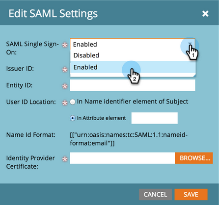

# Ajouter l’authentification unique à un portail {#add-single-sign-on-to-a-portal}

Si vous disposez d’un service d’annuaire qui authentifie les utilisateurs, vous pouvez autoriser l’authentification unique (SSO) dans Marketo. Nous prenons en charge cette fonctionnalité à l’aide de [!DNL Security Assertion Markup Language] (SAML) version 2.0 et ultérieure.

Marketo fonctionne comme un fournisseur de services SAML (SP) et dépend d’un fournisseur d’identités externe (IdP) pour authentifier les utilisateurs.

Une fois la connexion unique activée, l’IdP peut valider les informations d’identification d’un utilisateur. Lorsqu’un utilisateur souhaite utiliser le logiciel Marketo, l’IdP envoie ensuite un message SAML signé à Marketo, qui fait office de fournisseur de service. Ce message indique à Marketo que l’utilisateur est autorisé à utiliser le logiciel Marketo.

>[!NOTE]
>
>**Autorisations d’administrateur requises**

>[!IMPORTANT]
>
>Cela ne s’applique pas aux abonnements intégrés à Adobe Identity. Pour les abonnements intégrés à Adobe Identity, l’authentification unique est configurée au niveau de l’organisation Adobe dans Adobe Admin Console. Pour le moment, Adobe Admin Console ne prend en charge que le démarrage par SP. [En savoir plus ici](https://helpx.adobe.com/fr/enterprise/using/set-up-identity.html){target="_blank"}.

>[!NOTE]
>
>Êtes-vous un utilisateur [!DNL Microsoft Azure] ? Consultez leur [ tutoriel d’intégration ](https://learn.microsoft.com/en-us/entra/identity/saas-apps/marketo-tutorial){target="_blank"}. Pour votre information, il y a une faute de frappe à l’étape 5c de leur tutoriel. Veuillez définir l&#39;état du relais sur `https://<munchkinid>.mktoweb.com`, **_pas_** `https://<munchkinid>.marketo.com`.

## Envoi de la requête {#how-to-send-the-request}

* Envoyez la requête SSO, qui est une réponse SAML, à `https://login.marketo.com/saml/assertion/<your-munchkin-id>`
* Comme URL d’audience du fournisseur de services. Utilisez `http://saml.marketo.com/sp`
* Si vous utilisez l’attribut SPNameQualifier, définissez l’élément NameID pour Subject sur `http://saml.marketo.com/sp`
* Si vous fédérez plusieurs abonnements Marketo au même fournisseur SSO, vous pouvez utiliser des URL SP uniques pour chaque sous-réseau Marketo au format `http://saml.marketo.com/sp/<munchkin_id>`

>[!NOTE]
>
>Marketo ne prend en charge que la connexion initiée par le fournisseur d’identité (également appelée connexion initiée par l’IdP), dans laquelle l’utilisateur lance d’abord la page de connexion à l’IdP, s’authentifie, puis accède à Mon Marketo. Si votre abonnement Marketo a été déplacé vers Admin Console, Adobe Admin Console ne prend actuellement en charge que les services initiés par le fournisseur (également appelés services principaux). Des modifications peuvent avoir été apportées à votre expérience SSO.

## Remarques supplémentaires {#additional-notes}

* **Temps de synchronisation** - Pour un nouvel utilisateur, le traitement d’une demande initiale de connexion unique prend environ 10 minutes.
* **Mise en service des utilisateurs** - Les utilisateurs sont configurés manuellement par Marketo.
* **Autorisation** - Les autorisations utilisateur sont conservées dans Marketo.
* **Prise en charge d’OAuth** - Marketo ne prend actuellement pas en charge OAuth.
* **Propagation utilisateur automatique** également appelée « approvisionnement juste à temps », désigne le moment où la première connexion SAML d’un utilisateur peut le créer dans l’application web à laquelle il accède (par exemple, Marketo) et où aucune action manuelle d’administration n’est requise. Ce n’est pas pris en charge par Marketo pour le moment.
* **Chiffrement** - Marketo ne prend actuellement pas en charge le chiffrement.

>[!NOTE]
>
>Avant de commencer, ayez votre certificat de fournisseur d’identité au format X.509 et sous l’extension .crt, .der ou .cer.

## Mettre à jour les paramètres SAML {#update-saml-settings}

SSO est désactivé par défaut. Pour activer SAML et le configurer, procédez comme suit.

1. Accédez à la zone **[!UICONTROL Admin]**.

   

1. Cliquez sur **[!UICONTROL Authentification Sso]**.

   

   >[!NOTE]
   >
   >Si vous ne voyez pas **[!UICONTROL Authentification unique]** sous **[!UICONTROL Admin]**, contactez l’assistance de [Marketo](https://nation.marketo.com/t5/Support/ct-p/Support){target="_blank"}.

1. Dans la section **[!UICONTROL Paramètres SAML]**, cliquez sur **[!UICONTROL Modifier]**.

   

1. Remplacez **[!UICONTROL Authentification unique SAML]** par **[!UICONTROL Activé]**.

   

1. Saisissez votre **[!UICONTROL Identifiant de l’émetteur]**, **[!UICONTROL Identifiant de l’entité]**, sélectionnez l’**[!UICONTROL Emplacement de l’identifiant utilisateur]** puis cliquez sur **[!UICONTROL Parcourir]**.

   

1. Sélectionnez votre fichier **[!UICONTROL Certificat du fournisseur d’identité]**.

   

1. Cliquez sur **[!UICONTROL Enregistrer]**

   

## Mettre à jour les paramètres de la page de redirection {#update-redirect-page-settings}

1. Dans la section **[!UICONTROL Rediriger les pages]**, cliquez sur **[!UICONTROL Modifier]**.

   

   >[!NOTE]
   >
   >Les clients qui utilisent l’ID universel avec la connexion unique doivent saisir l’URL de connexion du fournisseur d’identité dans le champ **[!UICONTROL URL de connexion]**.

1. Saisissez une **[!UICONTROL URL de déconnexion]**. Il s’agit de l’URL vers laquelle l’utilisateur doit être redirigé lorsqu’il se déconnecte de Marketo.

   

1. Saisissez une **[!UICONTROL URL d’erreur]**. Il s’agit de l’URL vers laquelle l’utilisateur doit être dirigé en cas d’échec de la connexion à Marketo. Cliquez sur **[!UICONTROL Enregistrer]**

   

   >[!NOTE]
   >
   >Ces deux pages doivent être accessibles au public.

>[!MORELIKETHIS]
>
>* [Utilisation d’un identifiant universel pour la connexion à l’abonnement](/help/marketo/product-docs/administration/settings/using-a-universal-id-for-subscription-login.md){target="_blank"}
>* [Restreindre la connexion utilisateur à l&#39;authentification unique uniquement](/help/marketo/product-docs/administration/additional-integrations/restrict-user-login-to-sso-only.md){target="_blank"}
>* [Invitation d’utilisateurs Marketo à deux instances avec un ID universel](https://nation.marketo.com/t5/Knowledgebase/Inviting-Marketo-Users-to-Two-Instances-with-Universal-ID-UID/ta-p/251122){target="_blank"}
