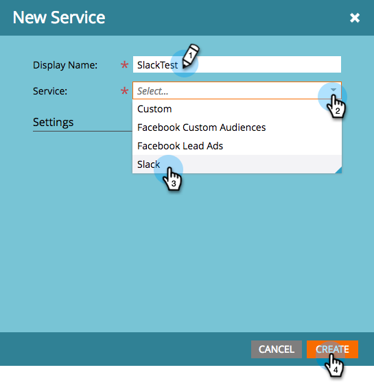

# Ajouter un Slack en tant que service LaunchPoint {#add-slack-as-a-launchpoint-service}

L’intégration du Slack comprend deux types de notification :

* **Notifications** système : Recevez des notifications de Slack concernant les événements importants de votre instance Marketo, tels que des alertes concernant les états de campagne en cours et tout problème nécessitant une attention immédiate (erreurs de gestion de la relation client et limites de l’API).
* **Moments** intéressants : Lorsqu&#39;un utilisateur connu a déclenché une notification Marketo Insight à partir d&#39;un compte client, les propriétaires de pistes peuvent être avertis par l&#39;intermédiaire d&#39;un Slack. Les notifications incluent des informations de piste ainsi que des détails sur le compte client.

>[!NOTE]
>
>**Autorisations d’administrateur requises**

>[!PREREQUISITES]
>
>Si vous n&#39;avez pas encore activé les notifications système Slack, contactez le [support Marketo](https://nation.marketo.com/t5/Support/ct-p/Support).

1. Accédez à **LaunchPoint**, puis sous **New** cliquez sur **New Service**.

   

1. Entrez un nom d&#39;affichage pour votre intégration de Slack. Dans la liste déroulante **Service**, sélectionnez **Slack**. Cliquez sur **Créer**.

   

1. Cliquez sur **Autoriser**. Cela ouvre le Slack dans un nouvel onglet, dans lequel vous allez compléter l&#39;autorisation et accorder à Marketo l&#39;autorisation d&#39;extraire les informations du Slack.

   

1. Dans le nouvel onglet Slack, saisissez l’URL de votre espace de travail et cliquez sur **Continuer**.

   

1. Entrez vos informations d’identification de Slack et cliquez sur **Se connecter**.

   

1. Dans la liste déroulante **Publier sur**, sélectionnez le canal dans lequel les notifications de Marketo doivent être publiées. Vérifiez les autorisations demandées, puis cliquez sur **Autoriser**.

   

1. L’écran de confirmation s’affiche ci-dessous. L&#39;onglet se ferme automatiquement.

   

1. Actualisez l’onglet Marketo et vérifiez que le Slack est désormais répertorié comme un service principal dans LaunchPoint.

   

   Les notifications commenceront maintenant à être publiées sur le canal sélectionné à l’étape 6. Ils ressembleront à quelque chose comme ça :

   
