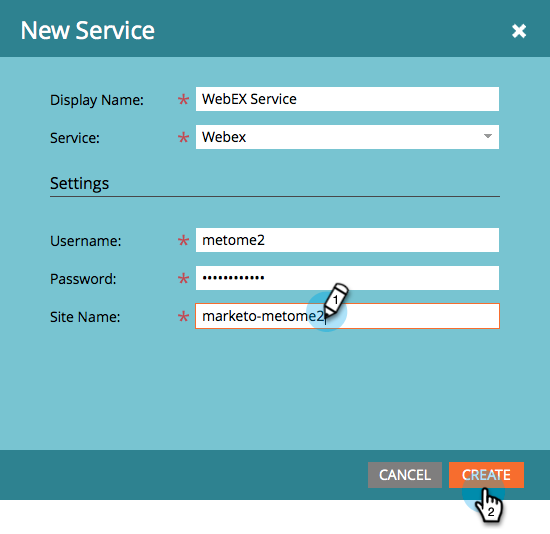
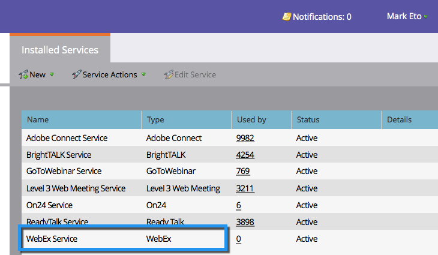

# Ajouter WebEx en tant que service LaunchPoint {#add-webex-as-a-launchpoint-service}

Marketo gère votre inscription et votre participation aux webinaires WebEx.

>[!NOTE]
>
>**Autorisations d’administrateur requises**

>[!NOTE]
>
>**Rappel**
>
>Un abonnement existant à WebEx et des droits d’administration sont nécessaires pour cette étape. Ayez à portée de main les paramètres suivants : Nom d’utilisateur, Mot de passe et Nom du site.

>[!NOTE]
>
>Le nom du site se trouve à la fin de l’URL utilisée pour se connecter à WebEx. Par exemple :
>
>`https://mycompany.webex.com/mw0300lc/mywebex/default.do?siteurl=**mycompa**`**ny**
>
>Attention : N’entrez pas l’URL complète dans ce champ ; entrez uniquement le nom du site !

1. Accédez à **Admin** et cliquez sur **LaunchPoint**.

   

1. Sélectionnez **Nouveau** , puis **Nouveau service**.

   

1. Saisissez un nom **** d’affichage. Sous **Service**, sélectionnez **WebEx**.

   

1. Entrez votre nom **d’utilisateur** et votre **mot de passe**.

   

1. Terminez le processus en entrant votre** Nom du site**, puis cliquez sur **Créer**.

   

1. Phénoménal ! Votre **WebEx** est désormais synchronisé avec Marketo.

   

>[!NOTE]
>
>**Articles connexes**
>
>Découvrez comment [créer un événement avec WebEx](../../../product-docs/demand-generation/events/create-an-event/create-an-event-with-webex.md).

