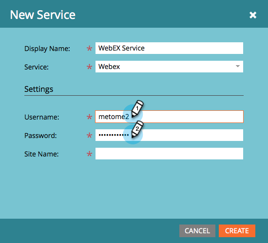

# Ajout de Webex en tant que service LaunchPoint {#add-webex-as-a-launchpoint-service}

Marketo Engage gère votre inscription et votre participation à vos webinaires WebSex.

>[!NOTE]
>
>**Autorisations d’administrateur requises**

>[!NOTE]
>
>Un abonnement existant à Webex et des droits d&#39;administration sont nécessaires pour cette étape. Définissez les paramètres suivants à portée de main : Nom d’utilisateur, mot de passe et nom du site.

>[!NOTE]
>
>Le nom du site se trouve à la fin de l’URL utilisée pour se connecter à Webex. Par exemple :
>
>`https://mycompany.webex.com/mw0300lc/mywebex/default.do?siteurl=mycompany`
>
>**Attention :** Ne saisissez pas l’URL entière dans ce champ ; entrez uniquement le nom du site !

1. Accédez à **Administration** et cliquez sur **LaunchPoint**.

   

1. Sélectionner **Nouveau** puis **Nouveau service**.

   

1. Saisissez un **Nom d’affichage**. Sous **Service**, sélectionnez **Webex**.

   

1. Saisissez votre **Nom d’utilisateur** et **Mot de passe**.

   

1. Terminez le processus en saisissant votre **Nom du site** puis cliquez sur **Créer**.

   

1. Phénoménal ! Votre **Webex** est désormais synchronisé avec Marketo.

   

>[!MORELIKETHIS]
>
>Découvrez comment [créer un événement avec Webex ;](/help/marketo/product-docs/demand-generation/events/create-an-event/create-an-event-with-webex.md).
