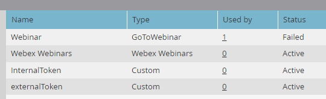

# Ajouter [!DNL Webex] en tant que service [!DNL LaunchPoint] {#add-webex-as-a-launchpoint-service}

Marketo Engage gère votre inscription et votre participation au webinaire [!DNL Webex]. Vous devez disposer d’un abonnement existant à [[!UICONTROL Webex]](https://www.webex.com/).

>[!NOTE]
>
>**Autorisations d’administrateur requises**

1. Accédez à la zone **[!UICONTROL Admin]**.

   

1. Cliquez sur **[!UICONTROL LaunchPoint]**.

   

1. Sélectionnez **[!UICONTROL New]**, puis **[!UICONTROL New Service]**.

   

1. Saisissez un **[!UICONTROL Nom d’affichage]**. Dans la liste déroulante **[!UICONTROL Service]**, sélectionnez **[!UICONTROL Webex Webinars]**.

   

1. Cliquez sur **[!UICONTROL Se connecter aux webex Webinars]**.

   

1. Webex s’ouvre dans un nouvel onglet. Connectez-vous à l’aide de vos informations d’identification Webex.

   

1. Une fois la connexion établie, l’onglet se ferme et le modal _Nouveau service_ dans Marketo Engage lit &quot;Le compte de webex Webinars est défini&quot;. Cliquez sur **[!UICONTROL Créer]**.

   

Votre **[!DNL Webex]** est maintenant synchronisé avec Marketo.

>[!MORELIKETHIS]
>
>[Créez un événement avec [!DNL Webex]](/help/marketo/product-docs/demand-generation/events/create-an-event/create-an-event-with-webex.md){target="_blank"}.
