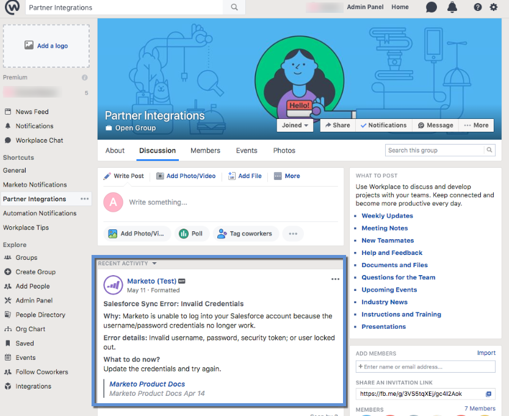

# Ajouter le lieu de travail par Facebook en tant que service LaunchPoint {#add-workplace-by-facebook-as-a-launchpoint-service}

L&#39;intégration en milieu de travail comprend deux types de notification :

* **Notifications** système : Recevez des notifications sur les événements importants de votre instance de marketing, telles que des alertes sur les états des campagnes en cours et tout problème nécessitant une attention immédiate (erreurs de gestion de la relation client et limites de l’API).
* **Moments** intéressants : Lorsqu&#39;une personne connue d&#39;un compte client a déclenché un Insight Marketo, les propriétaires de pistes peuvent être avertis via le lieu de travail. Les notifications incluent des informations de piste ainsi que des détails sur le compte client.

>[!NOTE]
>
>**Autorisations d’administrateur requises**

>[!PREREQUISITES]
>
>Si vous n&#39;avez pas encore activé les notifications sur votre lieu de travail, veuillez [contacter l&#39;assistance](http://docs.marketo.com/cdn-cgi/l/email-protection#5b282e2b2b34292f1b363a29303e2f3475383436).

1. Accédez à **LaunchPoint**, puis sous **New** cliquez sur **New Service**.

   

1. Entrez un nom d’affichage pour l’intégration de votre lieu de travail. Dans la liste déroulante **Service**, sélectionnez **Lieu de travail par Facebook**. Cliquez sur **Créer**.

   

1. Pour recevoir des notifications système et des moments intéressants, laissez les options telles quelles. Cliquez sur **Créer**.

   

1. Cliquez sur **Autoriser**. Ceci ouvre Lieu de travail dans un nouvel onglet, où vous allez compléter l&#39;autorisation et accorder au marketing l&#39;autorisation d&#39;extraire des informations du lieu de travail.

   

1. Dans le nouvel onglet Lieu de travail, saisissez votre adresse électronique professionnelle ou votre nom d’utilisateur en milieu de travail, puis cliquez sur **Continuer**.

   

1. Entrez vos informations d’identification de lieu de travail et cliquez sur **Connectez-vous**.

   

1. Dans la fenêtre contextuelle Lieu de travail, choisissez un groupe Facebook dans lequel vous souhaitez que les notifications de Marketo soient publiées (par exemple, Intégrations de partenaire). Cliquez sur **Installer**.

   

1. Vous devriez voir la notification de confirmation ci-dessous. L&#39;onglet se ferme automatiquement.

   

1. Actualisez l’onglet Marketo et vérifiez que le lieu de travail est désormais répertorié comme un service principal dans LaunchPoint.

   

   Les notifications vont maintenant commencer à publier sur le groupe Facebook que vous avez sélectionné à l’étape 7. Ils ressembleront à quelque chose comme ça :

   

