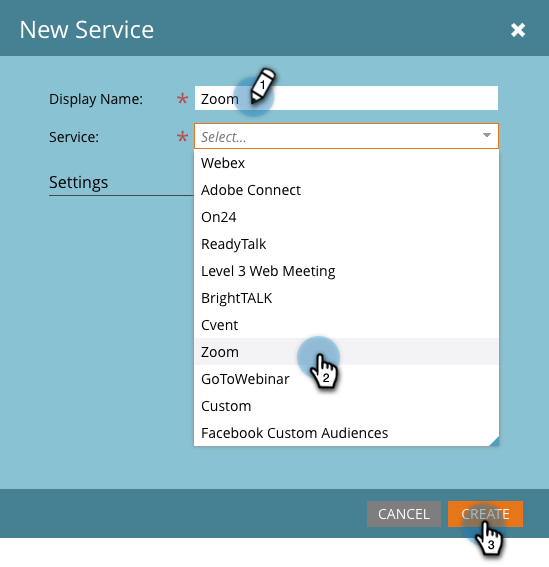

# Ajouter [!DNL Zoom] as a [!DNL LaunchPoint] Service {#add-zoom-as-a-launchpoint-service}

Marketo gère vos [!DNL Zoom] inscription et présence.

>[!NOTE]
>
>**Autorisations d’administrateur requises**

>[!NOTE]
>
>Un abonnement existant à [!DNL Zoom] Les droits d’administration et sont nécessaires pour cette étape. Posséder l’e-mail et le mot de passe que vous utilisez pour vous connecter à [!DNL Zoom] à la main.

1. Cliquez sur l&#39;icône **[!UICONTROL Admin]**.

   

1. Cliquez sur **[!UICONTROL LaunchPoint]**.

   

1. Sélectionner **[!UICONTROL Nouveau]** puis **[!UICONTROL Nouveau service]**.

   

1. Saisissez un **[!UICONTROL Nom d’affichage]**. Sous **[!UICONTROL Service]**, sélectionnez **[!UICONTROL Zoom]**.

   

1. Cliquez sur **[!UICONTROL Ouvrir une session dans le zoom]**.

   

1. Dans le [!DNL Zoom] fenêtre de connexion, saisissez [!DNL Zoom] informations d’identification et cliquez sur **[!UICONTROL Se connecter]**.

   

1. Une fois la fenêtre fermée, cliquez sur **[!UICONTROL Créer]**.

   

Votre [!DNL Zoom] est désormais synchronisé avec Marketo et se trouve dans la variable [!UICONTROL LaunchPoint] zone.

>[!CAUTION]
>
>Lorsque vous mettez à jour votre mot de passe dans Zoom, vous devez également le mettre à jour dans Marketo.

>[!MORELIKETHIS]
>
>Découvrez comment [créer un événement avec [!DNL Zoom]](/help/marketo/product-docs/demand-generation/events/create-an-event/create-an-event-with-zoom.md).
