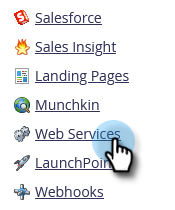

# Configuration des paramètres de votre API SOAP {#configuring-your-soap-api-settings}

>[!NOTE]
>
>Nous vous suggérons d’utiliser l’API REST. En savoir plus sur [developer.adobe.com](https://developer.adobe.com/marketo-apis/).

>[!NOTE]
>
>**Autorisations d’administrateur requises**

1. Accédez à la zone **[!UICONTROL Admin]**.

   

1. Cliquez sur **[!UICONTROL Services web]**.

   

1. Définissez une **[!UICONTROL Clé de chiffrement]** appropriée, cliquez sur **[!UICONTROL Enregistrer les modifications]** et transmettez toutes les informations à votre développeur.

   

>[!CAUTION]
>
>Votre point d’entrée SOAP et votre [!UICONTROL ID utilisateur] seront uniques. N’envoyez pas la capture d’écran de cet article à votre développeur.

>[!MORELIKETHIS]
>
>[Documentation de l’API SOAP ](https://experienceleague.adobe.com/en/docs/marketo-developer/marketo/soap/soap-api)
