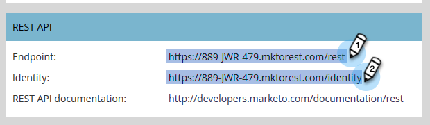

# Connexion de [!DNL BrightTALK] à Marketo {#connect-brighttalk-to-marketo}

Découvrez comment connecter votre canal [!DNL BrightTALK] à votre instance Marketo. Pour ce faire, vous devez être un administrateur pour les deux.

>[!NOTE]
>
>**Autorisations d’administrateur requises**

## Étapes dans [!DNL BrightTALK] {#steps-in-brighttalk}

1. Connectez-vous à [business.brighttalk.com/demandcentral](https://business.brighttalk.com/demandcentral/login){target="_blank"} et cliquez sur **[!UICONTROL Se connecter maintenant]**.
1. Sous [!UICONTROL Connecteur Marketo avancé], cliquez sur **[!UICONTROL Se connecter]**.
1. Vous accédez à l’écran des informations d’identification, ce qui vous demande : ID client, secret client, URL du service d’identité et URL du service REST. Pour obtenir ces informations, connectez-vous à Marketo.

## Étapes dans Marketo {#steps-in-marketo}

>[!NOTE]
>
>À ce stade, vous devrez configurer [!DNL API Only User Role] et [!DNL API User] pour limiter les autorisations dont dispose [!DNL BrightTALK] dans votre instance Marketo. Parce que nous avons déjà des articles pour ces étapes, nous allons vous y relier.

1. Créez un [rôle d’utilisateur API unique](/help/marketo/product-docs/administration/users-and-roles/create-an-api-only-user-role.md){target="_blank"}.

1. [Créez un utilisateur API](/help/marketo/product-docs/administration/users-and-roles/create-an-api-only-user.md){target="_blank"} à l’aide du rôle d’API [!DNL BrightTALK] que vous avez créé à l’étape 4.

1. Revenez à la zone **[!UICONTROL Admin]**.

   

1. Sous **[!UICONTROL Intégration]**, cliquez sur **[!UICONTROL LaunchPoint]**.

   

1. Cliquez sur la liste déroulante **[!UICONTROL New]** et sélectionnez **[!UICONTROL New Service]**.

   

1. Saisissez le **[!UICONTROL Nom d’affichage]** de votre choix. Cliquez sur la liste déroulante **[!UICONTROL Service]** et sélectionnez **[!UICONTROL Personnalisé]** (ne _pas_ sélectionner [!DNL BrightTALK]).

   

   >[!CAUTION]
   >
   >N’oubliez pas de ne pas sélectionner [!DNL BrightTALK] dans la liste déroulante. Il s’agit d’un champ que nous sommes en train de supprimer. Sa sélection peut créer des problèmes importants avec votre intégration [!DNL Marketo/BrightTALK].

1. Saisissez la [!UICONTROL Description] de votre choix. Cliquez sur la liste déroulante **[!UICONTROL API Only User]** et sélectionnez le [!DNL BrightTALK API User] que vous avez créé à l’étape 5. Cliquez sur **[!UICONTROL Créer]**.

   

1. Cliquez sur **[!UICONTROL Afficher les détails]** pour le service personnalisé que vous venez de créer.

   

1. Copiez (et enregistrez) l&#39;**[!UICONTROL ID client]** et le **[!UICONTROL Secret client]**. Cliquez sur **[!UICONTROL Fermer]**.

   

1. Sous **[!UICONTROL Intégration]**, sélectionnez **[!UICONTROL Services web]**.

   

1. Sous **[!UICONTROL Rest API]**, copiez (et enregistrez) le **[!UICONTROL point d’entrée]** et l’ **[!UICONTROL identité]**.

   

## Étapes supplémentaires dans [!DNL BrightTALK] {#additional-steps-in-brighttalk}

1. Revenez à l’écran de configuration du connecteur [!DNL BrightTALK] de l’étape 3, puis saisissez les informations d’identification que vous avez enregistrées à partir des étapes 12 et 14.

Une fois les informations d’identification authentifiées, vous êtes officiellement connecté à Marketo avec [!DNL BrightTALK]. L’étape suivante consiste à déterminer [les champs de données que vous souhaitez synchroniser](https://support.brighttalk.com/hc/en-us/articles/115005131274-BrightTALK-Connector-for-Marketo-Choose-the-Fields-to-Sync){target="_blank"}.
