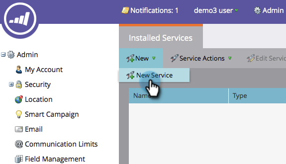

# Création d’un service personnalisé à utiliser avec l’API ReST {#create-a-custom-service-for-use-with-rest-api}

Si vous souhaitez effectuer une intégration avec Marketo via l&#39;API ReST, vous souhaiterez créer un service personnalisé. Voici comment.

>[!PREREQUISITES]
>
>* [Création d’un rôle utilisateur API uniquement](../../../product-docs/administration/users-and-roles/create-an-api-only-user-role.md)
>* [Créer un utilisateur API uniquement](../../../product-docs/administration/users-and-roles/create-an-api-only-user.md)

>

>[!NOTE]
>
>**Autorisations d’administrateur requises**

>[!NOTE]
>
>**Plongée profonde**
>
>Consultez la documentation destinée aux développeurs pour en savoir plus sur l&#39;API ReST. Nous avons aussi l&#39;API  SOAP si c&#39;est ce dont vous avez besoin.

>[!NOTE]
>
>Vous ne pouvez pas créer de service personnalisé si vous disposez du niveau Spark de Marketo.

## Créer un service personnalisé {#create-custom-service}

1. Accédez à **Admin** et cliquez sur **LaunchPoint**.

   

1. Sous **Nouveau**, cliquez sur **Nouveau service**.

   

1. Saisissez un nom **** d’affichage pour le service. Sélectionnez l’ **API Utilisateur** uniquement [précédemment créée](../../../product-docs/administration/users-and-roles/create-an-api-only-user.md).

   >[!NOTE]
   >
   >**Rappel**
   >
   >Notez que nous disposons déjà d’une intégration native pour les services de webinaires populaires.

   

1. Cliquez sur **Créer**.

   

   Oh oui ! Le service est maintenant créé, allons de l&#39;avant et obtenons toutes les informations d&#39;identification pour fournir l&#39;accès.

## Informations d’identification pour l’accès aux API {#credentials-for-api-access}

1. Accédez à **Admin** et cliquez sur **LaunchPoint**.

   

1. Cliquez sur Détails **de la** Vue pour le service LaunchPoint personnalisé créé ci-dessus.

   

1. Cliquez sur **Obtenir le jeton**.

   

1. Fournissez l&#39;ID de client***, la clé secrète **du** client, l&#39;utilisateur **** autorisé et le **jeton** à la personne chargée d&#39;établir la connexion.

   

>[!CAUTION]
>
>Ne partagez pas ces informations ; c&#39;est la porte de derrière de vos données. Gardez-le en sécurité !

