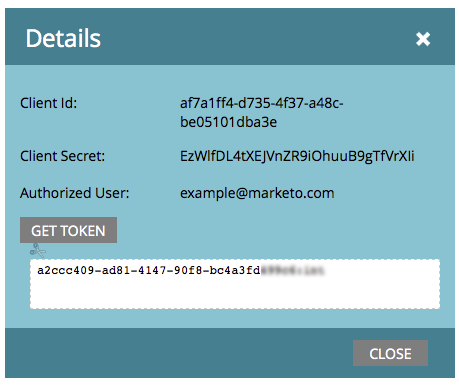

# Créer un service personnalisé à utiliser avec l’API ReST {#create-a-custom-service-for-use-with-rest-api}

Si vous souhaitez intégrer à Marketo via l’API ReST, vous devez créer un service personnalisé. Voici comment procéder.

>[!PREREQUISITES]
>
>* [Créer un rôle d’utilisateur API uniquement](/help/marketo/product-docs/administration/users-and-roles/create-an-api-only-user-role.md)
>* [Créer un utilisateur API uniquement](/help/marketo/product-docs/administration/users-and-roles/create-an-api-only-user.md)
>

>[!NOTE]
>
>**Autorisations d’administrateur requises**

>[!TIP]
>
>Consultez notre documentation destinée aux développeurs pour plus d’informations sur l’[API REST](https://developer.adobe.com/marketo-apis/). Nous disposons également de l’API [SOAP](https://experienceleague.adobe.com/fr/docs/marketo-developer/marketo/soap/soap-api) si c’est ce dont vous avez besoin.

## Créer un service personnalisé {#create-custom-service}

1. Accédez à la zone **[!UICONTROL Admin]**.

   

1. Cliquez sur **[!UICONTROL LaunchPoint]**.

   

1. Sélectionnez **[!UICONTROL Nouveau]** puis **[!UICONTROL Nouveau service]**.

   

1. Saisissez un **[!UICONTROL Nom d’affichage]** pour le service. Sélectionnez l’**[!UICONTROL Utilisateur API uniquement]** [précédemment créé](/help/marketo/product-docs/administration/users-and-roles/create-an-api-only-user.md).

   

   >[!NOTE]
   >
   >Notez que nous disposons déjà d’une intégration native pour les services de webinaire populaires.

1. Cliquez sur **[!UICONTROL Créer]**.

   

   Oh oui ! Le service est maintenant créé, allons-y et obtenons toutes les informations d’identification pour fournir l’accès.

## Informations d’identification pour l’accès à l’API {#credentials-for-api-access}

1. Accédez à la zone **[!UICONTROL Admin]**.

   

1. Cliquez sur **[!UICONTROL LaunchPoint]**.

   

1. Cliquez sur **[!UICONTROL Afficher les détails]** pour le service personnalisé [!UICONTROL LaunchPoint] créé ci-dessus.

   

1. Cliquez sur **[!UICONTROL Obtenir le jeton]**.

   

1. Fournissez les **[!UICONTROL ID client]**, **[!UICONTROL Secret client]**, **[!UICONTROL Utilisateur autorisé]** et **[!UICONTROL Jeton]** à la personne responsable de l’établissement de la connexion.

   

>[!CAUTION]
>
>Ne partagez pas ces informations ; c&#39;est la porte dérobée vers vos données. Gardez-le en sécurité !
