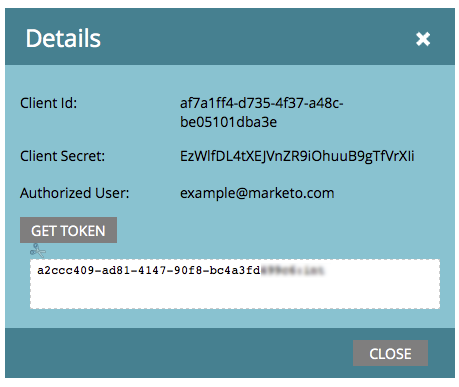

# Créer un service personnalisé à utiliser avec l’API REST {#create-a-custom-service-for-use-with-rest-api}

Si vous souhaitez intégrer à Marketo via l’API ReST, vous devez créer un service personnalisé.

>[!PREREQUISITES]
>
>* [Créer un rôle d’utilisateur API uniquement](/help/marketo/product-docs/administration/users-and-roles/create-an-api-only-user-role.md)
>* [Créer un utilisateur API uniquement](/help/marketo/product-docs/administration/users-and-roles/create-api-only-user.md)
>

>[!NOTE]
>
>**Autorisations d’administration requises**

>[!TIP]
>
>Consultez la documentation destinée aux développeurs pour plus d’informations sur l’[API REST](https://developer.adobe.com/marketo-apis/).

## Créer un service personnalisé {#create-custom-service}

1. Accédez à la zone **[!UICONTROL Admin]**.

   

1. Cliquez sur **[!UICONTROL LaunchPoint]**.

   

1. Sélectionnez **[!UICONTROL Nouveau]** puis **[!UICONTROL Nouveau service]**.

   

1. Saisissez un **[!UICONTROL Nom d’affichage]** pour le service. Sélectionnez l’**[!UICONTROL Utilisateur API uniquement]** [précédemment créé](/help/marketo/product-docs/administration/users-and-roles/create-api-only-user.md).

   

1. Cliquez sur **[!UICONTROL Créer]**.

   

   Le service est maintenant créé. Récupérez les informations d’identification à fournir pour l’accès.

## Informations d’identification pour l’accès à l’API {#credentials-for-api-access}

1. Accédez à la zone **[!UICONTROL Admin]**.

   

1. Cliquez sur **[!UICONTROL LaunchPoint]**.

   

1. Cliquez sur **[!UICONTROL Afficher les détails]** pour le service personnalisé [!UICONTROL LaunchPoint] créé ci-dessus.

   

1. Cliquez sur **[!UICONTROL Obtenir le jeton]**.

   

1. Fournissez les **[!UICONTROL ID client]**, **[!UICONTROL Secret client]**, **[!UICONTROL Utilisateur autorisé]** et **[!UICONTROL Jeton]** à la personne responsable de l’établissement de la connexion.

   

>[!CAUTION]
>
>Ne partagez pas ces informations, car elles permettent d’accéder à vos données .
