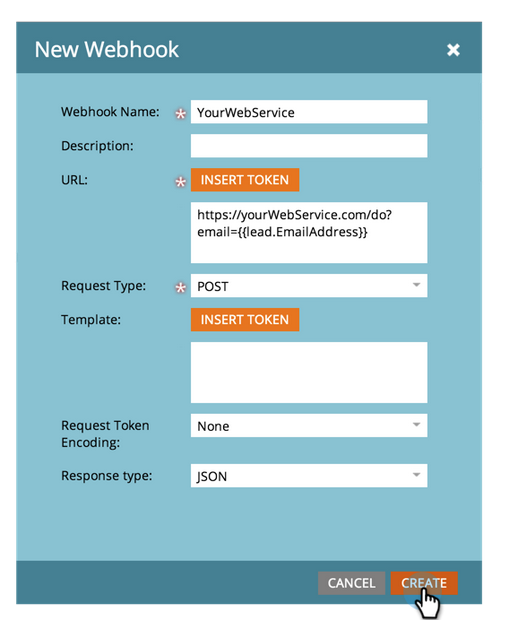

# Création d’un [!DNL Webhook] {#create-a-webhook}

Utilisez [!DNL Webhooks] pour tirer parti des services web tiers afin d’envoyer des SMS, de développer les données de personne, etc.

1. Accédez à la zone **[!UICONTROL Admin]**.

   

1. Cliquez sur **[!UICONTROL Webhooks]**.

   

1. Cliquez sur **[!UICONTROL Nouveau Webhook]**.

   

1. Nommez et configurez votre [!DNL Webhook].

   

   >[!NOTE]
   >
   >Cela inclut souvent la saisie de vos informations d’identification de service tierces en tant que paramètre d’URL ou dans le modèle POST.

   * **[!UICONTROL URL]** : saisissez l’URL que vous utilisez dans votre demande de service web. Pour insérer un jeton, tel que l’adresse e-mail de la personne (**`{{lead.Email Address}}`**), dans votre demande, cliquez sur **[!UICONTROL Insérer un jeton]**.

   * **[!UICONTROL Modèle]** : si vous souhaitez transmettre des informations dans le corps de la requête, saisissez via le modèle de payload. Modèles autorisés pour les types de requête suivants : POST, DELETE, PATCH ou PUT. Vous pouvez utiliser des formats de données tels que JSON ou XML. Pour insérer un jeton dans votre modèle, cliquez sur **[!UICONTROL Insérer un jeton]**.

   * **[!UICONTROL Encodage du jeton de demande]** : si les valeurs du jeton incluent des caractères spéciaux (par exemple une esperluette, «&amp; »), indiquez le format de votre demande (**JSON** ou **Formulaire/Url**).

   * **[!UICONTROL Type de réponse]** : sélectionnez le format de la réponse que vous recevez du service (**JSON** ou **XML**).

   * **[!UICONTROL Type de requête]** : sélectionnez la méthode HTTP à utiliser (DELETE, GET, PATCH, POST, PUT).

1. Cliquez sur **[!UICONTROL Créer]**.

   

>[!NOTE]
>
>En savoir plus dans l’exploration approfondie de [[!DNL Webhooks]](https://experienceleague.adobe.com/en/docs/marketo-developer/marketo/webhooks/webhooks){target="_blank"}.
