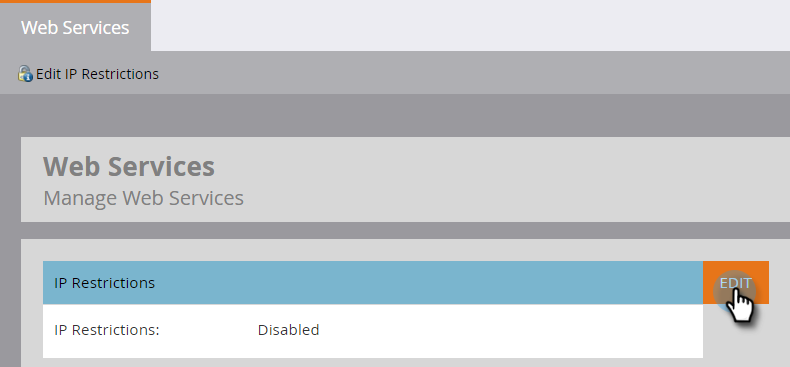

# Création d’une Liste autorisée pour l’accès aux API basées sur l’adresse IP {#create-an-allowlist-for-ip-based-api-access}

Parfois, vous souhaitez accorder l’accès à l’API uniquement à une adresse IP spécifique ou à une plage d’adresses. Pour ce faire, vous devez d’abord activer les restrictions, puis spécifier les adresses IP autorisées à utiliser les API.

>[!NOTE]
>
>**Autorisations d’administrateur requises**

1. Accédez à la zone **[!UICONTROL Admin]**.

   

1. Cliquez sur **[!UICONTROL Services Web]**.

   

1. Dans la zone **[!UICONTROL Restrictions d’IP]**, cliquez sur **[!UICONTROL Modifier],** ou cliquez sur **[!UICONTROL Modifier les restrictions d’IP]** dans le coin supérieur gauche.

   

1. Cochez la case **[!UICONTROL Activer les restrictions d’IP]** et saisissez les adresses IP à Placer sur la liste autorisée.

   

   >[!NOTE]
   >
   >Vous pouvez saisir une seule adresse IP ou une plage d’adresses, ou utiliser un caractère générique.

1. Cliquez sur **[!UICONTROL Ajouter]** pour ouvrir des champs supplémentaires afin de saisir d’autres adresses IP.

   

1. Cliquez sur **[!UICONTROL Enregistrer]**.

   
