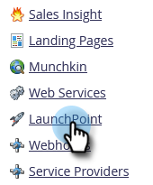

# Télécharger [!DNL Google Adwords] Journal d’activité {#download-googleadwords-activity-log}

Des trucs se produisent. Parfois, vous devez télécharger le journal des activités pour résoudre les problèmes.

1. Accédez à la zone **[!UICONTROL Admin]**.

   

1. Cliquez sur **[!UICONTROL LaunchPoint]**.

   

1. Recherchez votre service [!DNL Google AdWords] et cliquez sur **[!UICONTROL Télécharger le journal d’activité]**.

   

1. Un fichier .zip sera téléchargé sur votre ordinateur.
