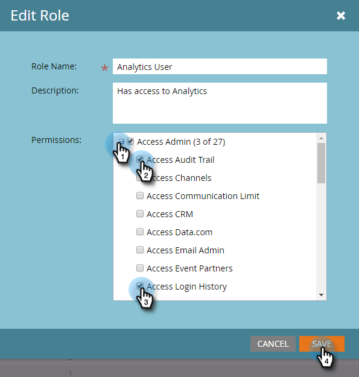

# Activer le journal d’audit {#enable-audit-trail}

Le journal d’audit est disponible pour tous les clients et est contrôlé par deux autorisations d’administrateur.

>[!NOTE]
>
>Par défaut, les deux autorisations sont activées pour tous les rôles d’administrateur système.

## Activation du journal d’audit pour un rôle {#enable-audit-trail-for-a-role}

1. Cliquez sur **[!UICONTROL Administration]**.

   

1. Sélectionner **[!UICONTROL Utilisateurs et rôles]** et cliquez sur **[!UICONTROL Rôles]**.

   

1. Sélectionnez le rôle pour lequel vous souhaitez activer le journal d’audit, puis cliquez sur **[!UICONTROL Modifier le rôle]**.

   

   >[!NOTE]
   >
   >Vous avez également la possibilité de créer un nouveau rôle et de lui accorder l’accès Suivi .

1. Développez l’objet **[!UICONTROL Accès à l’administrateur]** autorisation. Sélectionner **[!UICONTROL Journal d’audit d’accès]** et/ou **[!UICONTROL Historique de connexion des accès]**, selon vos besoins. Cliquez sur **[!UICONTROL Enregistrer]**.

   

   >[!NOTE]
   >
   >**Définition**
   >
   >**[!UICONTROL Journal d’audit d’accès]**: Donne aux utilisateurs l’accès aux deux [!UICONTROL Journal d’audit des ressources] et [!UICONTROL Journal d’audit de l’administrateur].
   >
   >**[!UICONTROL Historique de connexion des accès]**: Donne aux utilisateurs l’accès à [Historique de connexion des utilisateurs](/help/marketo/product-docs/administration/audit-trail/user-login-history.md).

## Attribution d’un rôle de journal d’audit à un utilisateur {#assign-audit-trail-role-to-a-user}

>[!PREREQUISITES]
>
>[Créer](/help/marketo/product-docs/administration/users-and-roles/create-delete-edit-and-change-a-user-role.md#create-a-role) ou [enable](#enable-audit-trail) un rôle existant, lui attribuant des autorisations Suivi .

1. Dans **[!UICONTROL Utilisateurs et rôles]**, cliquez sur **[!UICONTROL Utilisateurs]**.

   

1. Sélectionnez l’utilisateur auquel vous souhaitez accorder l’accès au journal d’audit, puis cliquez sur **[!UICONTROL Modifier l’utilisateur]**.

   

   >[!NOTE]
   >
   >Ce processus s’applique également lorsque vous créez un utilisateur.

1. Sélectionnez les rôles Suivi que vous avez créés. Dans cet exemple, nous avons créé &quot;Suivi - Ressource et administrateur&quot; et &quot;Suivi - Avec historique de connexion&quot;.

   

   >[!CAUTION]
   >
   >Si des espaces de travail sont activés, assurez-vous de cocher la case correspondant au rôle, qui sélectionne tous les espaces de travail. La désélection d’un espace de travail individuel masque le journal d’audit. Cela signifie que vous verrez les données du journal d’audit pour chaque espace de travail. Vous avez la possibilité de masquer les espaces de travail lorsque [filtrage](/help/marketo/product-docs/administration/audit-trail/filtering-in-audit-trail.md).

1. Cliquez sur **[!UICONTROL Enregistrer]**.

   
