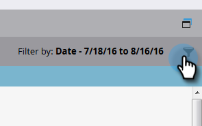
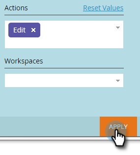

# Filtrage dans la piste d&#39;audit {#filtering-in-audit-trail}

Filtrez par période, type de ressource, utilisateurs, action entreprise, etc.

1. Cliquez sur **Admin**.

   

1. Sous **Sécurité**, sélectionnez **Piste d&#39;audit**.

   

1. Cliquez sur l&#39;icône de filtre.

   

   >[!NOTE]
   >
   >Il existe une multitude de combinaisons de paramètres de recherche possibles. Dans cet exemple, nous recherchons : _tous les e-mails - édités par n&#39;importe qui - au cours des sept derniers jours_.

1. Cliquez sur la liste déroulante **Période** et sélectionnez **7 derniers jours**.

   

1. Cliquez sur la liste déroulante **Type de ressource** et sélectionnez **Courriel**.

   

1. Cliquez sur la liste déroulante **Actions** et sélectionnez **Modifier**.

   

1. Cliquez sur **Appliquer**.

   

1. Les résultats filtrés s’affichent à gauche.

   

   C&#39;est tout !

   >[!NOTE]
   >
   >Si les espaces de travail sont activés, les données de contrôle s’affichent pour tous les espaces de travail. Si vous appliquez un filtre d’espace de travail, Marketo mémorise la valeur de l’espace de travail précédent chaque fois que vous utilisez la piste d’audit. Les autorisations d’espace de travail au niveau de la ressource sont appliquées.

   >[!MORELIKETHIS]
   >
   >[Modifier les détails dans la piste d’audit](/help/marketo/product-docs/administration/audit-trail/change-details-in-audit-trail.md)
