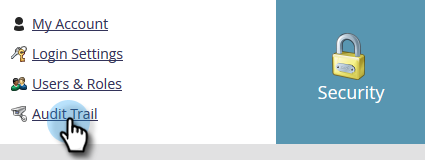
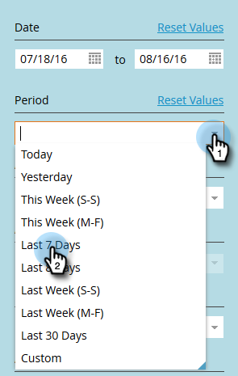
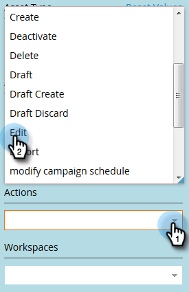
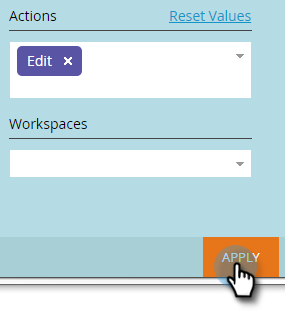

# Filtrage dans le journal d’audit {#filtering-in-audit-trail}

Filtrez par période, type de ressource, utilisateurs, action effectuée, etc.

1. Cliquez sur **[!UICONTROL Admin]**.

   

1. Sous **[!UICONTROL Sécurité]**, sélectionnez **[!UICONTROL Journal d’audit]**.

   

1. Cliquez sur l’icône de filtre.

   

   >[!NOTE]
   >
   >Il existe une multitude de combinaisons de paramètres de recherche possibles. Cet exemple localise : _tous les e-mails (modifiés par n’importe qui) au cours des sept jours précédents_.

1. Cliquez sur le menu déroulant **[!UICONTROL Période]** et sélectionnez **[!UICONTROL 7 derniers jours]**.

   

1. Cliquez sur la liste déroulante **[!UICONTROL Type de ressource]** et sélectionnez **[!UICONTROL E-mail]**.

   

1. Cliquez sur la liste déroulante **[!UICONTROL Actions]** et sélectionnez **[!UICONTROL Modifier]**.

   

1. Cliquez sur **[!UICONTROL Appliquer]**.

   

1. Les résultats filtrés s’affichent à gauche.

   

   >[!NOTE]
   >
   >Si les espaces de travail sont activés, les données d’audit de tous les espaces de travail s’affichent. Si vous appliquez un filtre d’espace de travail, Marketo mémorise la valeur de l’espace de travail précédent chaque fois que vous utilisez le journal d’audit. Les autorisations Workspace au niveau des ressources sont appliquées.

   >[!MORELIKETHIS]
   >
   >[Modifier les détails dans le journal d&#39;audit](/help/marketo/product-docs/administration/audit-trail/change-details-in-audit-trail.md)
