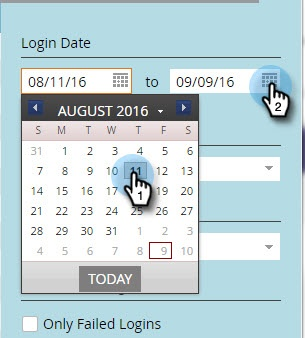

# Historique de connexion de l&#39;utilisateur {#user-login-history}

L&#39;historique de connexion de l&#39;utilisateur permet de maintenir la responsabilité et la sécurité en vous montrant exactement qui s&#39;est connecté à votre abonnement, y compris les tentatives de connexion ayant échoué.

>[!PREREQUISITES]
>
>Vous devez disposer d&#39;un rôle avec l&#39;autorisation Historique de connexion d&#39;accès activée pour vue de l&#39;historique de connexion d&#39;utilisateur.

L&#39;historique de connexion des utilisateurs identifie les personnes qui se connectent par :

* Heure et date de connexion
* Nom d’utilisateur et adresse électronique
* Rôle
* Espace de travail
* Adresse IP

Pour vue à l&#39;historique de connexion de l&#39;utilisateur :

1. Cliquez sur l&#39;onglet **Admin** et sous Sécurité, cliquez sur **Utilisateurs et rôles**.

   

1. Cliquez sur l&#39;onglet **Historique de connexion**. La liste affiche les connexions les plus récentes.

   

1. Utilisez le filtre pour restreindre votre recherche.

   

1. Sélectionnez une plage de dates à l’aide des sélecteurs de dates.

   

1. Vous pouvez également choisir dans la liste déroulante.

   

1. Sélectionnez des utilisateurs dans la liste déroulante **Utilisateurs**.** **

   ** 

   **

1. Cochez la case **Uniquement les connexions ayant échoué** pour n&#39;afficher que les connexions ayant échoué dans votre recherche.

   

1. Cliquez sur **Appliquer**.

   

   >[!NOTE]
   >
   >L’interface utilisateur affiche jusqu’à 30 jours de données. Si vous en avez besoin, vous pouvez télécharger les six derniers mois de données dans un fichier csv.

   >[!NOTE]
   >
   >**Articles connexes**
   >
   >    
   >    
   >    * [Aperçu de la piste d’audit](audit-trail-overview.md)

