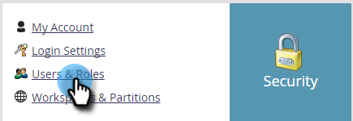

# Historique des connexions d’utilisateur et d’utilisatrice {#user-login-history}

L’historique de connexion de l’utilisateur contribue à maintenir la responsabilité et la sécurité en vous indiquant exactement qui s’est connecté à votre abonnement, y compris les tentatives de connexion ayant échoué.

>[!PREREQUISITES]
>
>Vous devez disposer d&#39;un rôle avec l&#39;autorisation Accéder à l&#39;historique de connexion activée pour afficher l&#39;historique de connexion de l&#39;utilisateur.

L’historique de connexion de l’utilisateur identifie les personnes qui se connectent en :

* Date et heure de connexion
* Nom et adresse e-mail de l’utilisateur
* Rôle
* Espace de travail
* Adresse IP

Pour afficher l’historique de connexion de l’utilisateur :

1. Accédez à la zone **[!UICONTROL Admin]**.

   

1. Sous Sécurité, cliquez sur **[!UICONTROL Utilisateurs et rôles]**.

   

1. Cliquez sur l’onglet **[!UICONTROL Historique de connexion]**. La liste affiche les connexions les plus récentes.

   

1. Utilisez le filtre pour affiner votre recherche.

   

1. Sélectionnez une période à l’aide des sélecteurs de date.

   

1. Ou choisissez dans la liste déroulante.

   

1. Sélectionnez les utilisateurs dans le menu déroulant **[!UICONTROL Utilisateurs]**.

   

1. Cochez la case **[!UICONTROL Uniquement les connexions ayant échoué]** pour afficher uniquement les connexions ayant échoué dans votre recherche.

   

1. Cliquez sur **[!UICONTROL Appliquer]**.

   

   >[!NOTE]
   >
   >L’interface utilisateur affiche jusqu’à 30 jours de données. Si vous en avez besoin, vous pouvez télécharger les six derniers mois de données dans un fichier CSV.

   >[!MORELIKETHIS]
   >
   >[Présentation du journal d&#39;audit](/help/marketo/product-docs/administration/audit-trail/audit-trail-overview.md)
