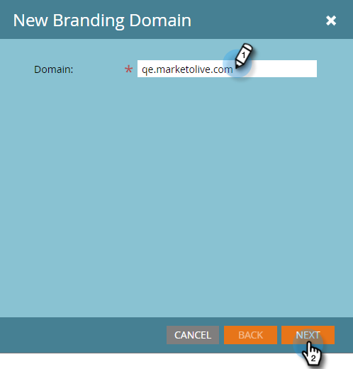

# Ajouter un domaine de branding supplémentaire avec des espaces de travail {#add-an-additional-branding-domain-with-workspaces}

Si vous disposez d’espaces de travail, vous pouvez ajouter des domaines de branding supplémentaires.

>[!PREREQUISITES]
>
>Vous devez d’abord [modifier votre domaine de marque par défaut](/help/marketo/product-docs/administration/email-setup/add-multiple-branding-domains/edit-your-default-branding-domain.md).
>
>Vous devez d’abord [remplacer le lien de suivi générique](/help/marketo/product-docs/administration/email-setup/add-multiple-branding-domains/edit-your-default-branding-domain-with-workspaces.md) par un domaine de branding avant d’ajouter d’autres domaines de branding.

1. Accédez à la zone **[!UICONTROL Admin]**.

   

1. Cliquez sur **[!UICONTROL Email]**.

   

1. Cliquez sur **[!UICONTROL Ajouter]** pour ajouter un domaine de marque supplémentaire.

   

1. Saisissez un nouveau domaine de marque. Cliquez sur **[!UICONTROL Suivant]**.

   

   >[!NOTE]
   >
   >Vous pouvez choisir d’en faire votre domaine de Principal pour un ou plusieurs espaces de travail, et tous les e-mails non envoyés existants définis sur « Par défaut » et tous les nouveaux e-mails créés seront définis par défaut sur le domaine principal. Vous pouvez modifier ce paramètre par e-mail.

1. Sélectionnez le nouveau domaine de branding et cliquez sur **[!UICONTROL Enregistrer]**.

   
