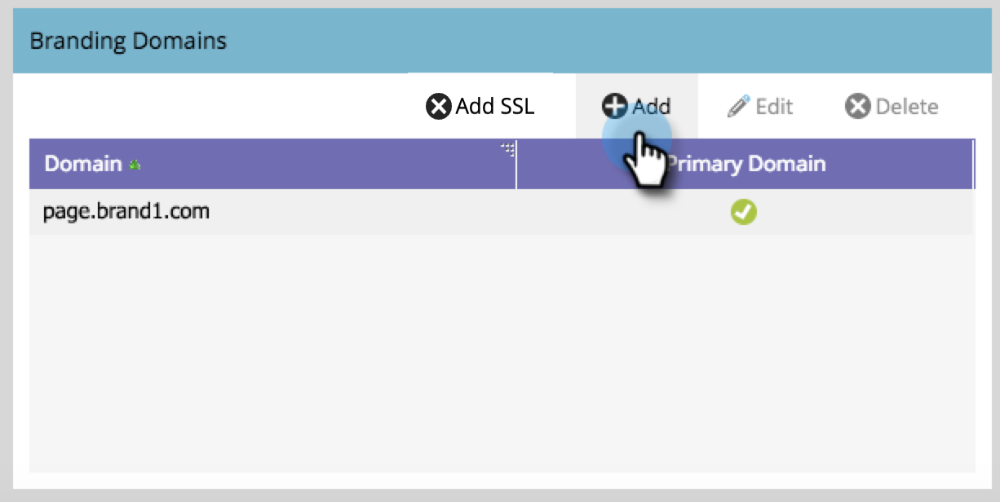

# Ajouter un domaine de branding supplémentaire {#add-an-additional-branding-domain}

Add an additional branding domain when you&#39;re running multiple brands out of a single Marketo instance and want them each to have their own branded tracking links.

>[!PREREQUISITES]
>
>You must [replace the generic tracking link](/help/marketo/product-docs/administration/email-setup/add-multiple-branding-domains/edit-your-default-branding-domain.md){target="_blank"} with a branded domain before adding additional branded domains.

1. Go to the **[!UICONTROL Admin]** area.

   

1. Cliquez sur **[!UICONTROL E-mail]**.

   

1. Click **[!UICONTROL Add]** to add an additional branding domain.

   {width="600"}

1. Enter the name of your new branding domain, select _Make Primary Domain_ and/or _Generate SSL Certificate_ (both optional), and click **[!UICONTROL Save]**.

   

>[!NOTE]
>
>* _Make Primary Domain_: Make this your primary domain, and all existing unsent emails set to &quot;Default&quot; and all newly created emails will default to the primary domain. You can [overwrite this on a per-email basis](/help/marketo/product-docs/administration/email-setup/add-multiple-branding-domains/overwrite-primary-domain-for-emails.md){target="_blank"}.
>
>* _Generate SSL Certificate_: You can create a Secure Sockets Layer (SSL) with the creation of the domain. The first tracking domain will initiate a one-time set up of infrastructure that may take a few hours. You will be notified upon completion, and you can then set up the first domain. To add SSL to your existing domains, please reach out to [Marketo Support](https://nation.marketo.com/t5/support/ct-p/Support){target="_blank"}.

## Edit SSLs for existing domains

Pour activer SSL pour vos domaines existants, procédez comme suit.

1. Dans la zone _[!UICONTROL Admin]_, sélectionnez **[!UICONTROL Email]**.

1. On the _[!UICONTROL Domain]_ tab, select the domain row and click **[!UICONTROL Add SSL]**.

   {width="600"}

1. Dans la boîte de dialogue, cliquez sur **[!UICONTROL Confirmer]**.

   {width="400"}

## Message d&#39;erreur {#error-messages}

<table><thead>
  <tr>
    <th>Erreur</th>
    <th>Détails</th>
  </tr></thead>
<tbody>
<tr>
    <td><i>Domain already exists.</i></td>
    <td>Un domaine du même nom existe déjà.</td>
  </tr>
  <tr>
    <td><i>Domain is not mapped to the default domain.</i></td>
    <td>Le domaine personnalisé n’est pas correctement mappé au domaine par défaut. Please verify the domain mapping settings and ensure the DNS configuration points to the correct default domain.</td>
  </tr>
  <tr>
    <td><i>SSL certificates could not be issued due to unsupported CAA records. Request your IT to update your CAA records.</i></td>
    <td>Les enregistrements CAA ne sont pas à jour. For those using Marketo Engage managed SSL certificates, CAA records need to be updated to certificates recommended by our vendor. Please contact your IT department to update the CAA records. See <a href="https://nation.marketo.com/t5/product-blogs/changes-to-marketo-engage-secured-domains-platform/ba-p/329305#M2246">this page</a> for additional details.</td>
  </tr>
  <tr>
    <td><i>Le certificat SSL a déjà été émis.</i></td>
    <td>Un certificat SSL existe déjà pour ce domaine personnalisé. Aucune autre action n’est nécessaire, sauf si le certificat a expiré ou doit être réémis.</td>
  </tr>
  <tr>
    <td><i>Le domaine par défaut est introuvable. Contactez l’assistance pour obtenir de l’aide.</i></td>
    <td>Un problème s’est produit lors de la recherche du domaine par défaut. Contactez l’assistance pour qu’elle enquête.</td>
  </tr>
  <tr>
    <td><i>Erreur inattendue lors de la création d'un domaine. Contactez l’assistance pour obtenir de l’aide.</i></td>
    <td>Une erreur inattendue s’est produite. Veuillez rassembler les journaux et les détails de l'erreur, puis signaler le problème à l'assistance de <a href="https://nation.marketo.com/t5/support/ct-p/Support" target="_blank">Marketo</a>.</td>
  </tr>
</tbody></table>

## Éléments à noter {#things-to-note}

* **Mappage DNS du domaine vers Marketo Engage** : avant d’ajouter des domaines dans l’interface utilisateur, vous devez [mapper des CNAME à un domaine fourni par Marketo](https://experienceleague.adobe.com/en/docs/marketo/using/getting-started/initial-setup/setup-steps#customize-your-landing-page-urls-with-a-cname){target="_blank"}.

* **SSL personnalisés** : si vous avez besoin d’un SSL personnalisé, envoyez un ticket [Support technique](https://nation.marketo.com/t5/support/ct-p/Support){target="_blank"}. N’utilisez pas la case à cocher en libre-service pour la création SSL.

* **SSL préexistants** : lors de l’ajout d’un domaine, le système recherche les SSL préexistants, qui peuvent avoir été créés manuellement au préalable. Si vous rencontrez cette validation, créez votre domaine sans sélectionner la création SSL, et nous les connecterons pour vous. [Contactez l’assistance](https://nation.marketo.com/t5/support/ct-p/Support){target="_blank"} plus d’informations/d’options.

* **Suppression de domaines** : la suppression automatique d’un domaine **ne supprime pas** le certificat SSL. Ce mécanisme de sécurisation empêche les erreurs utilisateur qui entraînent la suppression des certificats SSL d’un site web. Si vous souhaitez supprimer les certificats SSL, [contactez l’assistance &#x200B;](https://nation.marketo.com/t5/support/ct-p/Support){target="_blank"}.

* Si le domaine que vous ajoutez est répertorié comme autre chose qu’un CNAME, la possibilité d’ajouter d’autres domaines de suivi de marque est verrouillée. Vous devrez modifier tout domaine existant et vous assurer qu’il s’agit d’un enregistrement CNAME et non d’un enregistrement A, par exemple. Le bouton Ajouter recherche uniquement les CNAME et les CNAME de manière dynamique.

>[!MORELIKETHIS]
>
>[Modifiez Votre Domaine De Branding Par Défaut](/help/marketo/product-docs/administration/email-setup/add-multiple-branding-domains/edit-your-default-branding-domain.md){target="_blank"}
