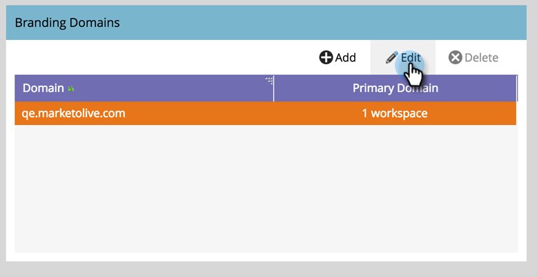

# Modification de votre domaine de marque par défaut avec des espaces de travail {#edit-your-default-branding-domain-with-workspaces}

1. Accédez à la zone **[!UICONTROL Admin]**.

   

1. Cliquez sur **[!UICONTROL Email]**.

   

1. Dans le tableau Domaines de valorisation de marque, sélectionnez le domaine générique actuel et cliquez sur Modifier pour le remplacer par le domaine de marque de votre entreprise.

   

   >[!NOTE]
   >
   >**[!UICONTROL Ajouter]** ne fonctionne pas tant que vous n’avez pas modifié le domaine générique. **[!UICONTROL Supprimer]** ne fonctionne pas tant que vous n’avez pas ajouté un second domaine.
   >
   >Vous ne pouvez pas ajouter de domaine supplémentaire tant que vous n’avez pas modifié le domaine générique pour la première fois.

1. Saisissez le nom de votre domaine par défaut et cliquez sur **[!UICONTROL Suivant]**.

   

1. Cliquez sur **[!UICONTROL Enregistrer]**.

   

>[!NOTE]
>
>Lors de l’ajout de domaines de marque supplémentaires, vous pouvez choisir de le faire comme domaine principal pour un ou plusieurs espaces de travail. Tous les emails non envoyés existants sont alors définis sur &quot;Par défaut&quot; et tous les emails nouvellement créés sont définis par défaut sur le domaine principal. Vous pouvez le remplacer par email.

Désormais, vous pouvez [ajouter des domaines de marque](/help/marketo/product-docs/administration/email-setup/add-multiple-branding-domains/add-an-additional-branding-domain-with-workspaces.md) supplémentaires dont vous avez besoin pour les espaces de travail.
