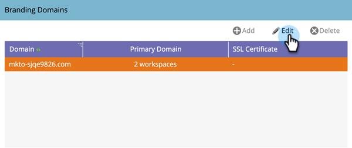

# Modifier votre domaine de branding par défaut {#edit-your-default-branding-domain}

La modification de votre domaine de marque par défaut est la première étape de l’utilisation des domaines de marque.

>[!PREREQUISITES]
>
>Assurez-vous d’avoir [configuré un CNAME dans votre DNS](/help/marketo/getting-started/initial-setup/configure-protocols-for-marketo.md){target="_blank"} avant d’ajouter vos domaines de marque dans Marketo.

1. Accédez à la zone **[!UICONTROL Admin]**.

   

1. Cliquez sur **[!UICONTROL E-mail]**.

   

1. Dans le tableau [!UICONTROL Domaines de marque], sélectionnez le domaine générique et cliquez sur Modifier pour le modifier en domaine de marque de votre société.

   

   >[!NOTE]
   >
   >Vous ne pouvez pas ajouter de domaine supplémentaire tant que vous n’avez pas modifié le domaine générique pour la première fois.

1. Saisissez le nom de votre domaine par défaut et cliquez sur **[!UICONTROL Enregistrer]**.

   

Vous pouvez désormais [ajouter des domaines de marque supplémentaires](/help/marketo/product-docs/administration/email-setup/add-multiple-branding-domains/add-an-additional-branding-domain.md){target="_blank"} si nécessaire.

>[!NOTE]
>
>Si vous devez mettre à jour ou supprimer un protocole SSL existant, contactez l’assistance technique de [Marketo](https://nation.marketo.com/t5/support/ct-p/Support){target="_blank"}.
